

## Project 2: Fun with Filters and Frequencies

In this project, we explored filtering, image sharpening, among other things. 

Also, I finally got LaTeX to work on GitHub pages, this totally didn't take me ~3
hours that I could have been spent actually doing the project :)

### Finite Difference Operator

#### Theory 
The finite difference operator is essentially a discrete version of a derivative, and
as explored in the previous project, it's one of the ways that we can generate an
edge map of an image. The principle is that an edge in an image is defined by a
sudden change in the intensity of the pixels in an image, so this would be reflected
as a spike in the derivative. So, one way we can detect this is to build a filter
that computes this derivative. 

One of the simplest derivatives that we can implement is called a **finite difference
operator**, defined as:

$$\mathbf{D}_x = \begin{bmatrix} 1 & -1 \end{bmatrix}, \quad \mathbf{D}_y =
\begin{bmatrix} 1 \\ -1 \end{bmatrix} $$

which we can convolve with our image to find the derivative along the specified axis.
To see why this works, consider how a derivative is computed:

$$ f'(x) = \lim_{h \to 0} \frac{f(x + h) - f(x)}{h} $$

It would be awesome to take a continuous derivative, but becuase we're working in a
discrete space the best we can achieve is:

$$ f'(x) = f(x + 1) - f(x) $$

since the shortest difference we can take for $$h$$ is 1 to subtract adjacent pixels. 
Then, we see the finite
difference operator come out as the prefactors to $$f(x)$$. The convolution process
allows us to "slide" this operator across all the pixels in our image, thereby
allowing us to compute the derivative along one direction for the entire image. Doing
this for the $$x$$ and $$y$$ direction gives us all the information we need, then we
can combine them in a pythagorean-like fashion to get a gradient magnitude:

$$\nabla = \sqrt{\mathbf D_x^2 + \mathbf D_y^2}$$

We can then visually inspect the plot of the gradient magnitude to see the edges in
the image, which we will do below. 

#### The "Cameraman" image

Now, let's test this out on `cameraman.png`, by initializing $$\mathbf D_x$$ and 
$$\mathbf D_y$$ as numpy arrays and using `scipy.signal.convolve2d()` to help us: 

  

  
 Edge map along one direction using the Finite difference
  operators Dx and Dy. 
 

We can see that convolution with $$\mathbf D_x$$ shows us vertical edges, which is
expected since vertical edges have a nonzero gradient in the $$x$$ direction.
Likewise, convolution with $$\mathbf D_y$$ gives us the horizontal edges. We can then
combine these images together to get a full edge map, basically combining the
horizontal and vertical edge information into a single image: 

  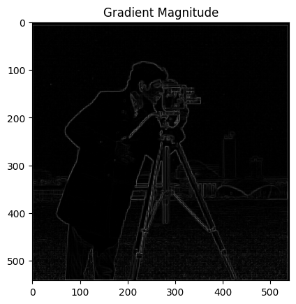

  
 The gradient magnitude map of cameraman.png 
 

This is quite a good edge map, as we see the complete outline of the camerman in this
image. (if we were to do project 1 with this edge map, my best is that this would be
more than enough to get a good alignment) However, many of the features in the background 
have been lost, and if we want to recover that information too, one thing we can try
is to set a "threshold" on the edge map, to "boost" values larger than a certain
threshold to 1. Ideally, I wanted a threshold that could capture the background, but
also limit the amount of grass that makes it into the final image. After some
experimentation, I found that a threshold of about 0.13 probably works the best:  

  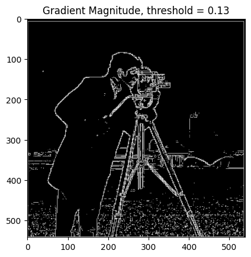

  
 The gradient magnitude map of cameraman.png, with threshold 
  
 

Although we do let some grass in, it's a good middleground between the grass and
getting the big tower in the background in the edge map. 

#### Derivative of Gaussian Filter

One thing we immediately notice about the gradient magnitude picture (threshold and
non-threshold) is how pixelated the image is. One way to fix that while still
retaining the edges is to run the image through a smoothing process first, then
compute the gradient. One way to do this is to convolve the image with a *Gaussian
filter*. To do this, I used `cv2.getGaussianFilter()` to get a 1D Gaussian filter
then took the outer product with itself to generate a 2D one. Then, I ran the same
convolutions as before, and this is what we get: 

  

  
 Side by side of the gradient magnitude with and without the
  Gaussian filter.   
 

One thing we immediately notice is that the intensity of the lines on the right are
higher than that on the left. This is somewhat expected, since the Gaussian filter
takes an average over the surrounding pixels, so each pixel value is boosted by the
values around it. The more obvious difference between the two images is that the one
on the right has smoother edges, which is also visually pleasing in my opinion, and
is a direct result of the Gaussian filter. 

It's also important to mention that the parameters we choose for the Gaussian filter
have a *huge* effect on the resulting image. For the image above, I chose $$\sigma =
0.7$$, which gave a smoothed image where we can still resolve the edges. But, if we
choose a larger $$\sigma$$, say $$\sigma = 2$$, the edges become extremely faint and
the image is now too smooth:

  

This method involved us making the Gaussian filter, convolving the image with it, and
then taking two more convolutions to compute the $$\mathbf D_x$$ and $$\mathbf D_y$$
together. There's another way we can do this, which is to first convolve the Gaussian
with the two derivative filters, then taking the convolution along their respective
direction. We then combine them together, and we get:

  

The approaches look identical, and comparing them side by side that's also what we
see:

  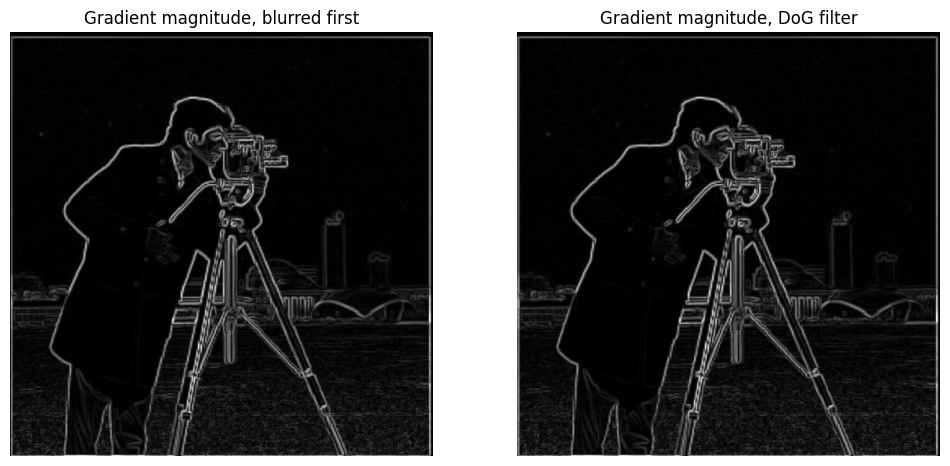

This result is exactly what we expect, since the convolution operation is associative
so it shouldn't matter which order we convolve things in.

### Image Sharpening

One takeaway from the recent lectures is that while images are 2-dimensional arrays,
they are no different fundamentally from a 1D signal, and so many properties that
apply in 1D also apply here. For instance, with a 1D audio signal it is possible to
decompose it into a collection of sine waves, called the Fourier series. This is also
possible in 2D, also with a collection of sine waves, one along each axis. This means
that we can actually represent an image in frequency space! Here, a high frequency
wave usually tends to correspond to sharp changes along a given direction.   

With this in mind, we can actually think of the Gaussian filter from the previous
section in a different light: because its purpose is to smooth out edges, then
consequently it also filters out high frequencies, which is also known as a low-pass
filter. Now comes the clever bit: because we know that the Gaussian kernel is a low
pass filter, we can *subtract out* the filtered image from the original, which
leaves only the high frequency stuff behind. Then, we can add these high frequency
artifacts back onto the original image, which gives us a "sharpened" version of the
original image. Doing this with the provided `taj.jpg`, we can see the difference
very clearly:

  

On the right, all the little patterns on the Taj are much more intense, and in
general all the edges present in the image seemed to have grown in intensity. You can
also see enhancement in the tiling on the pathway below as well. All of these features
mentioned are in the high frequencies, as their patterns are dense and complex in the
image. Therefore, it makes natural sense that these are the features that will be
enhanced. We were also asked to do this with a couple images of our choice, so to
connect with the previous project, I wanted to see what would happen if I tried
sharpening the `cathedral.jpg` that we worked with last project, and here are the
results:

  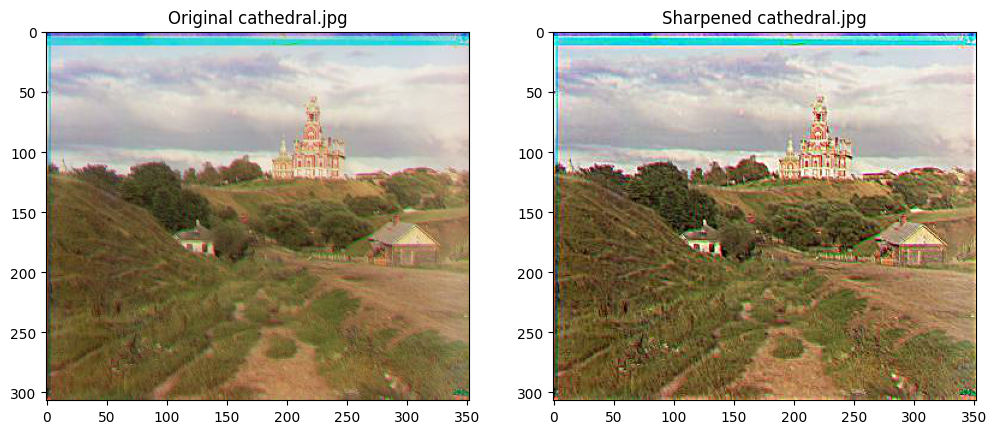

Overall, we see that all the lines in the image are more intense (darker), 
which is particularly noticeable on the cathedral itself, as it's design and shape 
are full of high frequency features. I also decided to do this with an image from my
own photo collection, here's a macro image (with a DSLR) I took two years ago:

  

One thing I noticed was how little the sharpening did to this image -- as in it
basically changed nothing, and I'm not entirely sure why. One possibility is that the
image is *too* high quality and doesn't have much to sharpen, but in my view this is
unsatisfactory because the sharpening process should make high frequency changes
*more* apparent, regardless of their initial resolution. One thing I ruled out was
the size of my filter, as I ran the image on a 100x100 filter to see if it was
because my filter size was too small, and I may be coping but the image may have
turned out *slightly* clearer:

  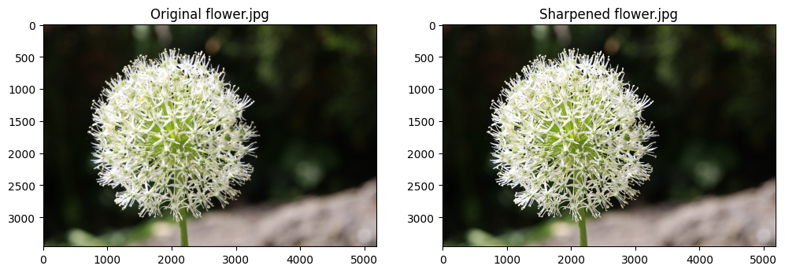

Honestly I have no idea, I ran this for 15 minutes and am desperate for any
indication that the sharpening did anything to my image. I also want to point out
that I tried this with other macro shots of flowers, and using the sharpening tool on
Lightroom (as a preview to see if my sharpening does anything) I found no change in
almost all the images.  

Anyways, with that aside, the last part of this section asked us to take an image,
blur it, then sharpen it back again. I did this with the `cathedral.jpg` we saw
earlier, and this is what I get:

  

Comparing the original to the sharpened image, we see that many of the high
frequency features have returned in the image as expected. Compared to the original
image the outlines are darker, similar to the result we got from just sharpening.
These darker lines are actually expected -- because the blurred image has completely
taken away some high frequency components, the part of the image we are adding back
via sharpening is the highest frequency that *wasn't* taken away by the blurring,
which is certainly lower than what was taken away. As a result, there should be no
expectation that the sharpened image should look identical to the original image.   

## Hybrid Images 

Now we turn to creating hybrid images, which is the product of stacking the high
frequency components of one image onto the low frequency components of another. The
combined image then contains different features from both images. The combined image
has the property that when we look from afar, we see the low-frequencies only, but
from up close we see only the high frequencies. This phenomenon takes advantage of
our eyes' limited ability to perceive high frequencies from a distance, and as
a result the high frequency components of the image are completely washes away. 

To test, I did this on the provided images `DerekPicture.jpg` and `nutmeg.jpg`,
passing the former through a low-pass filter to keep only the low frequencies and
subtracting the low frequencies out of the latter to keep only the high frequencies.
This process was done by passing `nutmeg.jpg` through a low pass filter and
subtracting the result off of the original image. Doing so, I get this: 

  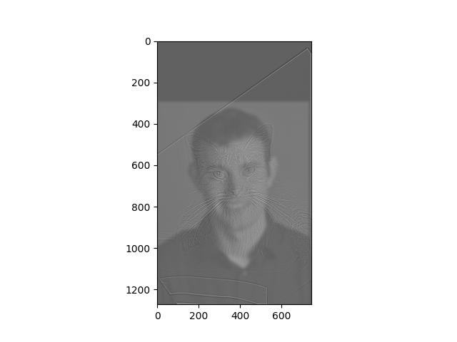

We can see the outline of the cat from up close, but from afar all we see is Derek,
as expected. The cat was a little hard to see in the final image, so I intentionally
boosted the image by multiplying all the cat pixel values by 3, which seemed to do a
really good job at making the cat seem more apparent.  

### Other images 

As for some other images I tried, this is one I really liked:

  

Sadly I don't own a cat so I had to take a stock cat and bread images for this one :( 

Anyways, this is the one hybrid image that turned out the best for me, so this is the
one I decided to run the FFT plots on: 

  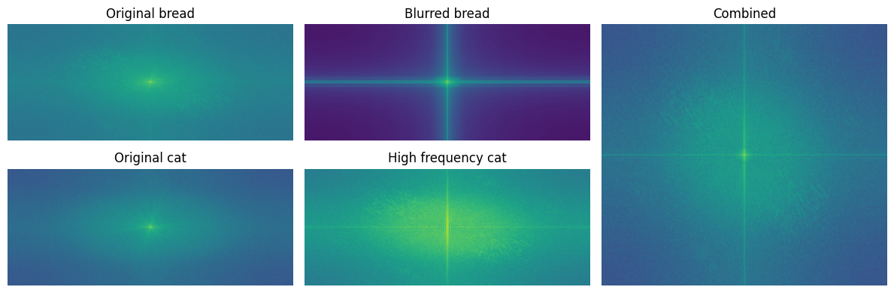

From the FFT plots it's very clear to see the effects of the computations we're
doing, especially in the FFT for the blurred bread image, as we see that the
convolution has killed all the high frequency images and only left the low frequency
ones. On the flip side, it's apparent that the high pass filter also worked really
well, since the high frequencies are much stronger in the filtered image compared to
the original. The combined image is naturally a combination of these two, nothing
much to comment on there. 

#### Failure Case

Along the way, I also encountered some failure cases. Generally, I found that
failures would occur when the overall features of both images were vastly different,
or too similar. For instance, here's a failure case of an among us overlaid with a
kidney bean (credit to my roommate for coming up with this idea, I thought it was
kinda funny so I did it):

  

  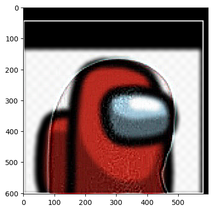

The image aligns pretty well for the most part, except that it's still possible to tell
the bean apart from the background among us character because of the differing
shapes, making the high frequency components still visible. This is also probably
exacerbated by the fact that the background of the among us is white (featureless),
and as a result the sharp edge of the kidney bean really sticks out against the
backdrop. This image also
has the high frequency components boosted by 10x, so that it would be visible in the
composite image. Although this was a failure, I did notice something: that when I
turned the image into grayscale, the high frequency bean seemed to jump out at me
more than the color image, which leads me to suspect that the incorporation of color
actually enhances the low-frequency image more than the high frequency image. This is
evidenced below, when we compare the images together:

  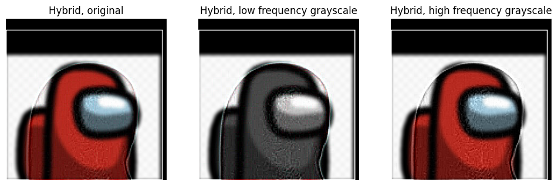

It seems that when we make the low frequency image to be grayscale, the high
frequency bean pops out a lot more compared to the original, and making the high
frequency into grayscale doesn't seem to do much to the image. I don't know if
there's a biological reason for why this is, but empirically speaking it just seems
that I can see the bean from much farther away when the background is grayscale
compared to when it's not.     
  
 

### Laplacian Stack, Blending

Here, we replicate the process outlined by Burt and Adelson (1983) for blending two
images together. Obviously, we could just take the left half of one image and
concatenate it to the right half, but this would lead to a very sharp "jump" from one
image to the other that it doesn't give us a pleasant result. We could also try naive 
alpha blending, but as described in lecture this gives a bad result because we will
experience "ghosting", or basically the low frequency features of one image bleed
into the other. 

The reason this ghosting occurs is because with the naive alpha blending approach,
there is no single suitable window that can both blend the high frequency components
nicely and also wash out the low frequency ones. As a result, no matter what blending
window you choose, there will always be artifacts. One fix they suggest is to blend
in layers, by using a *Laplacian stack*. Unlike a Gaussian stack (which is
implemented by successively taking the Gaussian kernel), each image in the Laplacian
stack contains the part of the image in a specific range of frequencies only. This is
done by taking the difference between consecutive images in the Gaussian stack. 

Now, we can properly "alpha blend" the images together, by blending the images in the
Laplacian stacks together, then combine both at the end. This process is now possible
due to the limited range of frequencies in each Laplacian stack image, thereby
allowing us to choose an appropriate blending window. As a preliminary, I did this on
the apple and orange image, which gave me these results:
 

  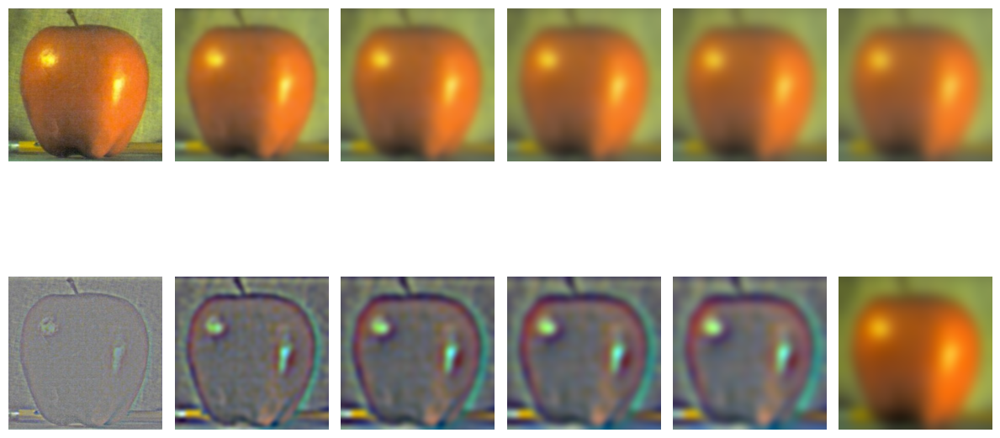

  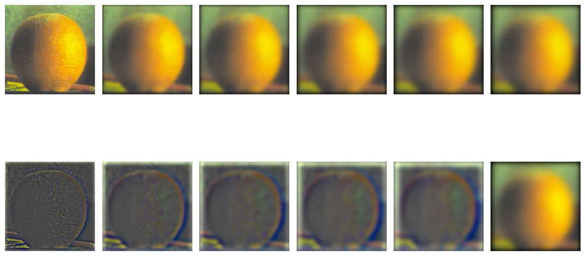

  
 Gaussian and Laplacian stacks for apple and orange pictures.
  The top image is for the apple, the bottom image is for the orange. 
 

 
Overall, I think this part turned out quite nicely. One thing to note is that the
last image of the Laplacian stack is the same as the last image of the Gaussian
stack; this is intentional, since the last image is supposed to contain the lowest
frequency components. Throughout this process, the only major hiccup I came across
was normalizing the Laplacian stack images so that the images were visible, otherwise
they would be nearly completely black.  

### Blending

To implement the blending process, we use a mask which is just a 2D array full of
ones on one half, and zeros on the other. This was generated using `np.ones()` and
`np.zeros()` of the appropriate dimensions. Visually, as an image, this mask is just
white on one side and black on the other, and we successively convolve this with a
Gaussian filer to smooth out the boundary, which is our blending window: 

  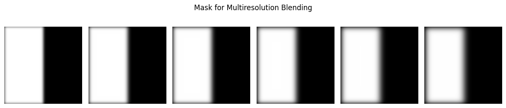

To choose the blending window, I just convolved the mask with a Gaussian kernel, of
the same length and $$\sigma$$ as the ones I used to generate the Gaussian and Laplacian
stacks. I did this for consistency's sake, so that the highest frequency I'd be
blending would correspond to the highest frequency present in the mask, ensuring that
there'd be no ghosting. Applying this mask to the corresponding image in the Laplacian stack,  
blending them together, and collapsing the stack, we end up with this final image for the 
oraple:
 

  

One thing I did do differently than what was taught in lecture was that I used a
filtered version of the first mask for the highest frequency layer, as I found that
without doing this it would still leave a noticeable seam in the image. This also
makes sense intuitively, since a step function effectively has infinite frequency,
and thus you'd get seams regardless of the frequencies in your image.  

 
## Other Blending Images
   
Here's some other images I blended together. Starting off, I took inspiration from
the lecture slides and saw some images of tiling, so I thought I'd try my hand at
doing some blending with two different tiling patterns as well. Recently, I learned
about the aperiodic monotile, a pattern that tiles the plane using only a single
tile, without repeats! The figure below shows the process: the first two images are
the original images, and the third and fourth are the blended results:

  

I still got some ghosting in my image at the seam, but I honestly think that a little
bit of ghosting is unavoidable when the images are so different, as in this case. One
thing I did experiment with was the effect of color on this image, and I found that
the ghosting is much more apparent in the color image when compared to the grayscale. 
I think this is because the color makes the images pop out more (especially the
blues), which makes the ghosting more apparent. 

I'm also very big blackboard enthusiast, so I decided to blend together the white and 
the colored Hagoromo chalk together:

  

These images were taken on my phone, which has a native resolution of `3024 x 4032`,
and when convolved with the Gausisans this would take far too long to compute (20+ mins per
image), so I decided to downscale to `907 x 1210` using the `sk.transform.rescale()`
function outlined in the previous project. Doing this cuts down the runtime from over
15 minutes to roughly 1.5 minutes, which is much more manageable. Combining the
blending:

  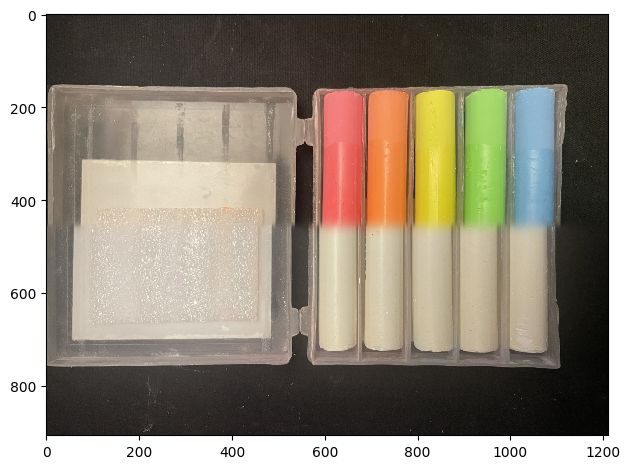

When making this image, the alignment of the individual chalk sticks was not easy,
and this took multiple tries to get right. Each image also took over a minute of
computation to combine together, so this took very long to get right (~1 hour of
tweaking). I'm quite happy with the result though, the alignment isn't bad and the
horizontal mask does the blending of the two images very nicely. I also ran this with
a bigger Gaussian (`sigma = 20`), which gave me this:
    

  

Honestly, there isn't much difference between the two, and though in principle I do
believe that if we used an *even larger* Gaussian that there would be a difference, I
don't really have the computational power or the patience to find out. 

#### Irregular mask

I also used this image and tried doing an irregular mask, by replacing the middle
chalk stick with the colored yellow stick. I used Adobe photoshop to get the
irregular mask, and this is what it looks like: 

  

This mask worked really well! There are still some shades of yellow around the
edges of the chalk, but overall we see that the yellow chalk has been replaced by a
white one. I think the edges are due to the uneven shape of the chalk sticks, as
they're not completely identical (this is also apparent in the raw images), so
so the masks won't overlap completely as they would in an ideal world.   
