

## Project 4A: Image Warping and Mosaicing

In this part of the project, we explored how to warp images using correspondence
points, and also learned how to generate a mosaic "stitch" of images. With this
ability, we are now able to join together images to create a panoramic image. The
most fun part of this project was definitely the image stitching, and it's still
interesting to think about how my phone camera manages this, since it's somehow doing
this stitching live. 

### Part 1: Shooting Images

I was doing this project late in the physics building, so I took a couple for this
project:

  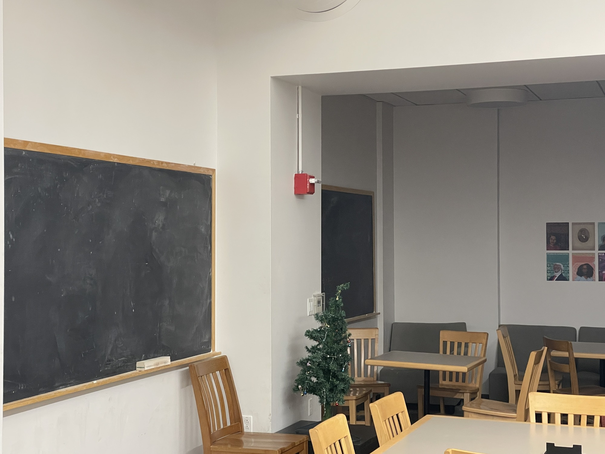
  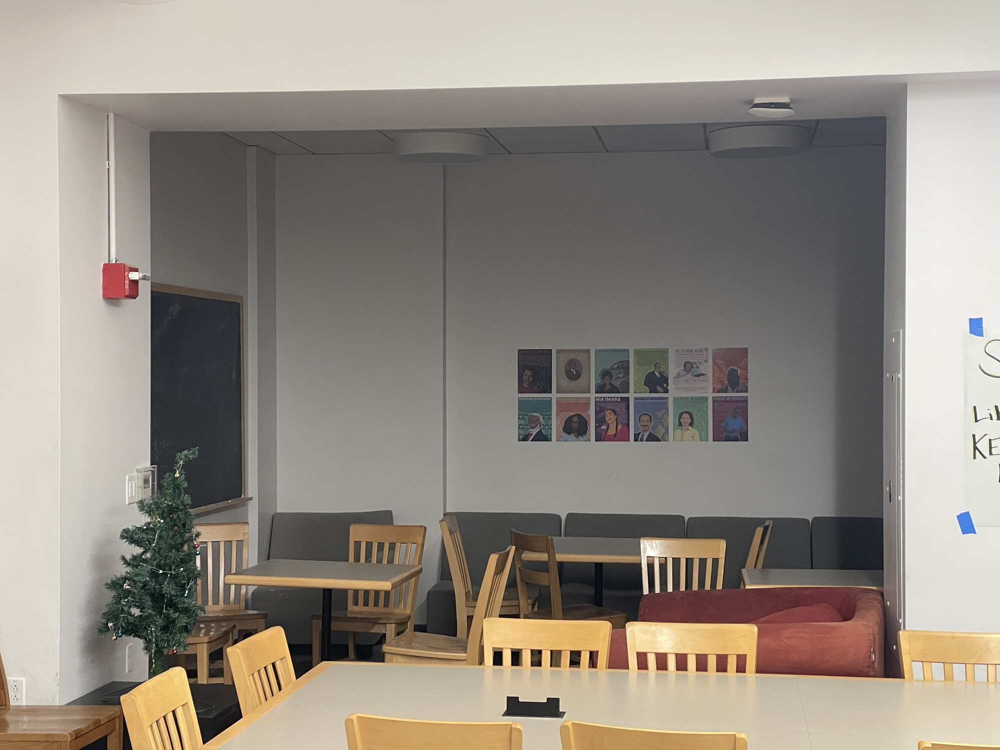

These were images I took on my phone, and then rescaled to a smaller size to make the
computation faster. 

I also took some using my DSLR camera, shown below:

### Part 2: Computing Homography

The objective of this section is to explain how we find a homography matrix $$H$$
to match the correspondence points $$p$$ to $$p'$$ for both images. For this
explanation, we follow Alec Li's outline in detail. In essence, finding $$H$$ boils
down to solving the equation $$p' = Hp$$, which can be written out in
vector form as:

$$\begin{bmatrix} a & b & c \\ d & e & f \\ g & h & 1 \end{bmatrix}
\begin{bmatrix} x\\ y\\ 1 \end{bmatrix} = \begin{bmatrix} wx' \\ wy' \\ w'
\end{bmatrix}$$

Solving this system of equations amounts to solving a linear system of equations,
defined by the linear system:

$$ \begin{bmatrix} x & y & 1 & 0 & 0 & 0 & -x x' & -yx'\\ 0 & 0 & 0 & x & y & 1  &
-xy' & -yy' \end{bmatrix}
\begin{bmatrix} a\\ b\\ c\\ d\\ e\\ f\\ g\\ h\end{bmatrix}
= \begin{bmatrix} x' \\ y \end{bmatrix}$$

This system of equations can be solved for each set of pairs $$(p, p')$$, and we can
solve them in parallel by just stacking the different coordinates to make a bigger
matrix and column vector on the right. One thing to note about this system is that
once 4 points are selected, then the system has an exact solution for $$a, b, ...,
h$$. Once more than 4 points are given, then the system becomes *overdetermined*, and instead of an exact solution we need to use least-squares to find the optimal 
homography matrix $$H$$. This method is precisely what the `computeH(im1_pts,
im2_pts)` function does.  

### Part 3: Warping

Now that we've computed $$H$$, we can now move on to performing the actual warp. In
my case, we will have two images `im1` and `im2`, and I will always be warping 
`im1` onto `im2`. Similar to the previous project, in order to perform the warp we
just have to apply $$H$$ to every pixel in `im1`, however this would lead to 
issues because the size of the warped image is almost always larger 
than that of `im1`, so if we were to naively just apply $$H$$ to `im1` 
we will get an undersampled image. Thus, to fix this, we first warp the corners of
`im1` to their appropriate locations, which will also define the polygon in which 
the warped `im1` will reside in. This inevitably sometimes causes the corners of
`im1` to be negative, so to fix this we find the values `x_translate` and
`y_translate` that are required so that the warped `im1` rests perfectly in the 
first quadrant. With the coordinates of the warped `im1` determined, we can now
iterate through every point in this polygon and use 
$$H^{-1}$$ to compute the corresponding point in `im1`
(while also accounting for the translation mentioned just now), then use the same
interpolation procedure we used in the previous project, involving 
`scipy.interpolate.regularGridInterpolator()`. 

Despite the similarities there are also a couple differences between this 
version of warping and the previous version.
First, notice that the third coordinate of $$Hp$$ is not always 1, but in 
order to index into our arrays properly we require that it equals 1, so we need to 
normalize so that $$w = 1$$ every time we apply $$H$$ or $$H^{-1}$$. Another
difference is that in this implementation, I spent a great deal of effort in figuring
out how to vectorize the transformation, so that it can be done much faster. This
ultimately paid off, as it sped up the runtime from ~2 minutes per image to less than 
1 second.  

#### Rectification

One application of this warping procedure is that we can now perform a procedure
called *rectification*, which is the process of perspective transforming a component
in an image into a particular shape. In our case, we will take perspective images of
rectangular objects, then perform the warp such that after warping the image is now
square, or rectified. To do this, we define the correspondence points on the image to 
be rectified as usual, but for the points $$p'$$ we wish to map to I instead defined 
a hard-coded set of points `[0, 400], [400, 400], [400, 0], [0, 0]`, which forms 
a rectangle. This hard-coding makes sense here, since ultimately all we want to do is
transform the selected points in our `im1` into a rectangle. For this part, I took a
photo of my chalk case (hagoromo like project 2!) and also a textbook that was kind
of collecting dust in my home:

    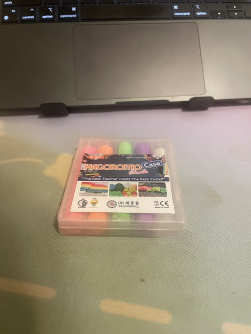
    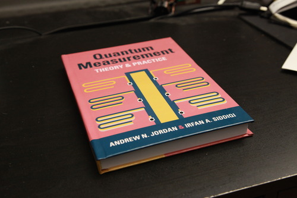

As an aside, notice the difference in image quality -- the textbook I took with my
DSLR, and the chalk case I took with my phone (bad quality by comparison). To compute
the rectification, I selected the following points from both images (marked in red on
the left and yellow on the right):

    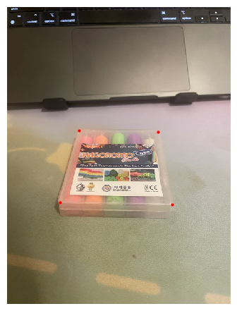
    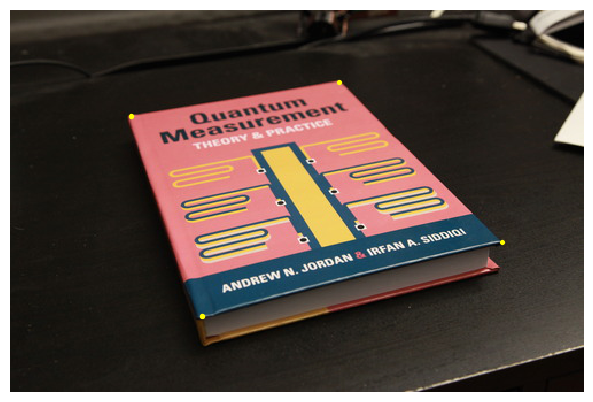

Correspondingly, here are the rectified images: 

    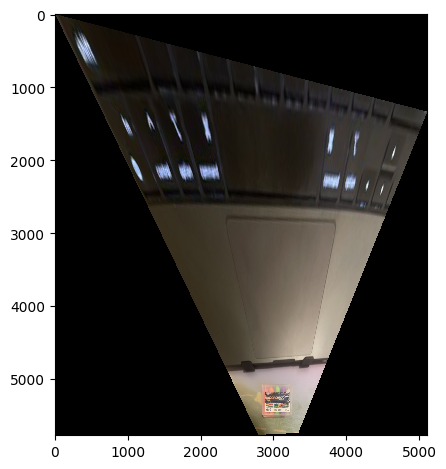
    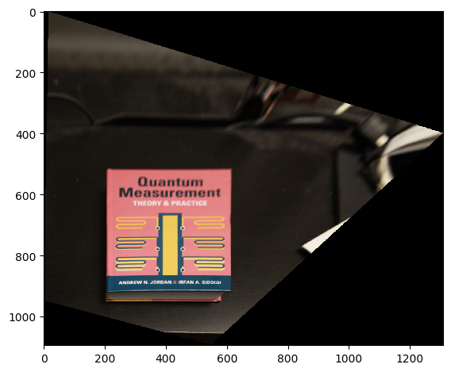

One thing to note with these rectified images is that the more extreme the angle, the
more extreme the resulting warp: it's clear that the chalk case was shot at a much
shallower angle than the textbook, and as a result the corresponding warp distorts
the upper region much more heavily, to the point where the chalk case almost can't be
seen. That said, these images are evidence that the rectification procedure does
indeed work, since the resulting objects (the chalk case and the textbook) both
appear square in the final image.

#### Creating a Mosaic

Now, we move on to the final part for part A of this project, which is to join two
images together using our correspondences and stitch the images together. To do this,
I implemented a function `blend(im1, im2, x_translate, y_translate)` to do exactly
this. 

To implement this function, there are a couple things to consider, the first of which
is the translation. Recall that in morphing `im1`, we had to translate it to
guarantee that the resultant image lies in the first quadrant. Because this shift
globally translated every coordinate in `im1`, in order for the alignment to be
proper we also need to apply this translation to `im2` as well; this is why we have
the arguments `x_translate, y_translate` passed into the `blend` function. 

Next, we need to determine the final size of the canvas, which can be done by taking
the maximum between the shifted `im2` and the morphed `im1` dimensions. 
Then, for the blending process itself, we do a 2-band Laplacian pyramid (same as what
we did in project 2), blending the
low and high frequency components separately. In the low frequency regime, we take a
distance transformation using `cv2.distanceTransform()`, then take a weighted linear
combination of `im1_low` and `im2_low` (the result of `im1, im2` 
after the low-pass filter) to determine the low-frequency component of the stitched
mosaic. The weights are calculated using 
$$\text{weight}_i = \frac{d_i}{d_1 + d_2}$$ which is very similar to the 
alpha blending procedure we used in project 2. One thing to note about this weight
procedure is that sometimes it gave me division by zero errors, so I had to
artificially add a very small `1e-5` to fix this.
 
For the high frequency components, the distance transformation alone was used as the
tiebreaker for whether we took the high frequency in `im1` or `im2` 
for each point. That is, if `dist1` has a higher value than `dist2` at 
some `[x, y]`, then `im1_high[x, y]` was taken, and vice versa. 

Finally, we add the low and high frequency components together, in the same way we
collapsed the Laplacian stack in Project 2. Taking the images
from the physics building, defining the corresponding points, we can get the
following image stitching:  
 

    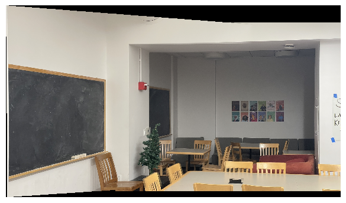

I also took some photos of Physics 251, one of the quiet spots in physics that I like
to go to for studying: 

    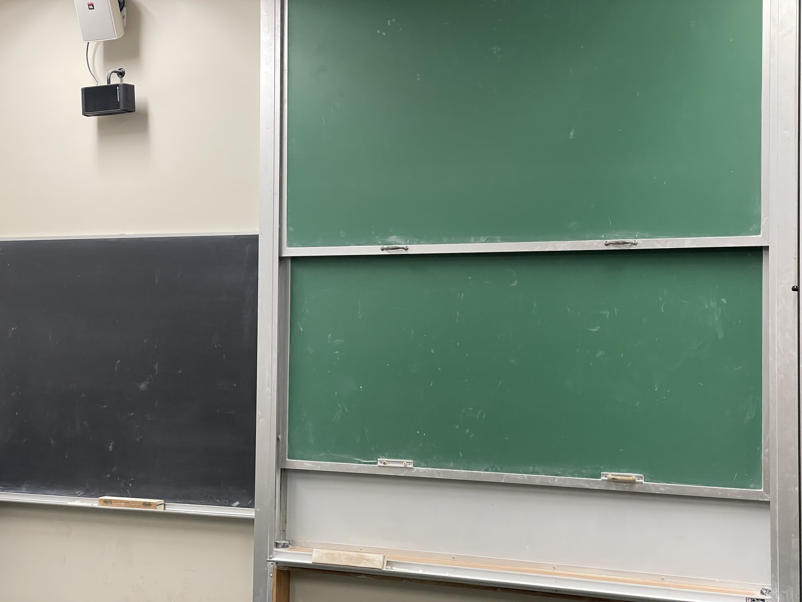
    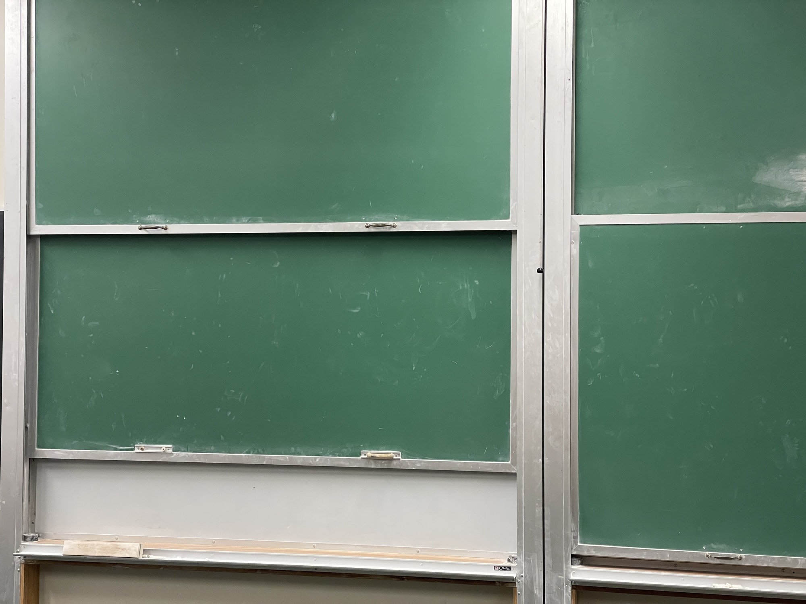

And here's the stitched image:

    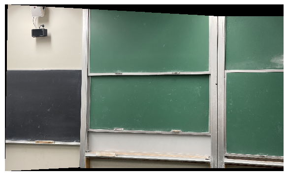

And another of 251, from a different angle:

    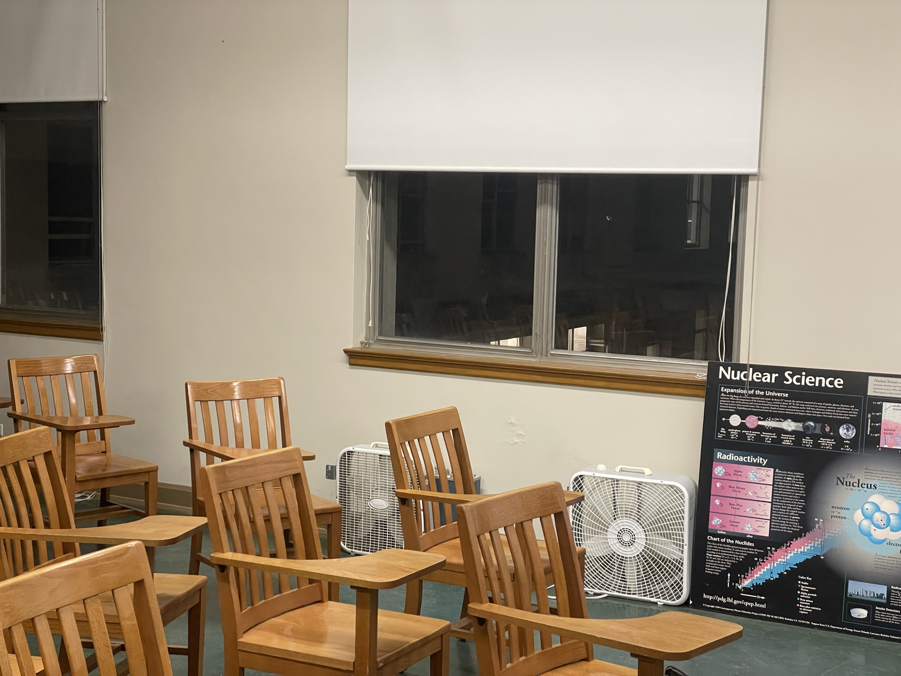
    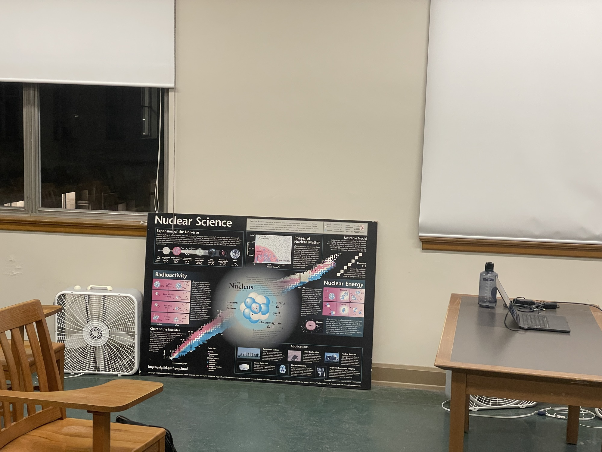

Stitched:

    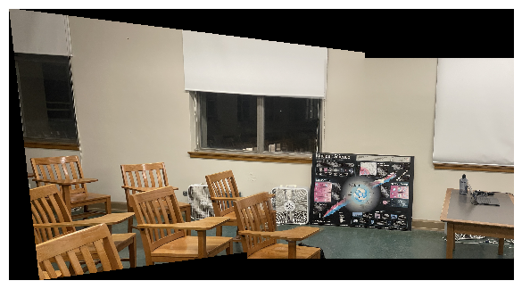

Unfortunately, you can't read the text on that poster, because I downscaled the
image beforehand so that I can use the provided correspondence tool (the image was
too big otherwise). Nonetheless, all three of these images demonstrate evidence of
proper stitching, since we can't see any seams where the interfaces of the two images
lie.

This last part of the project was incredibly cool to see working: in retrospect, it
the mathematics and procedure make a lot of sense to me, but even after everything I
still think that it's extremely impressive that we're able to come up with procedures
to accomplish complex tasks like this -- and all it really takes is a little linear
algebra.   

