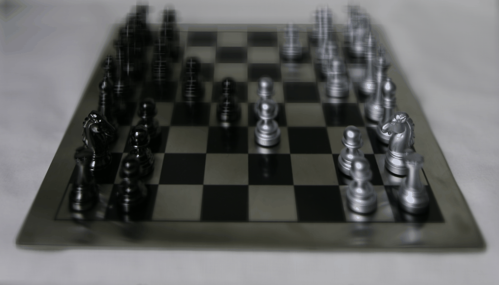
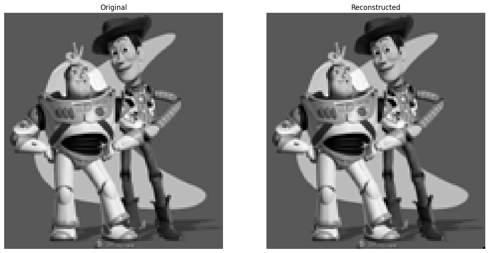
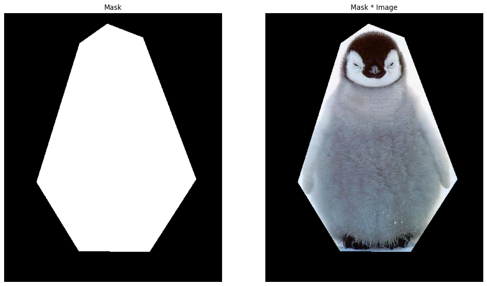
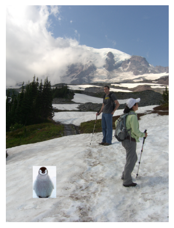
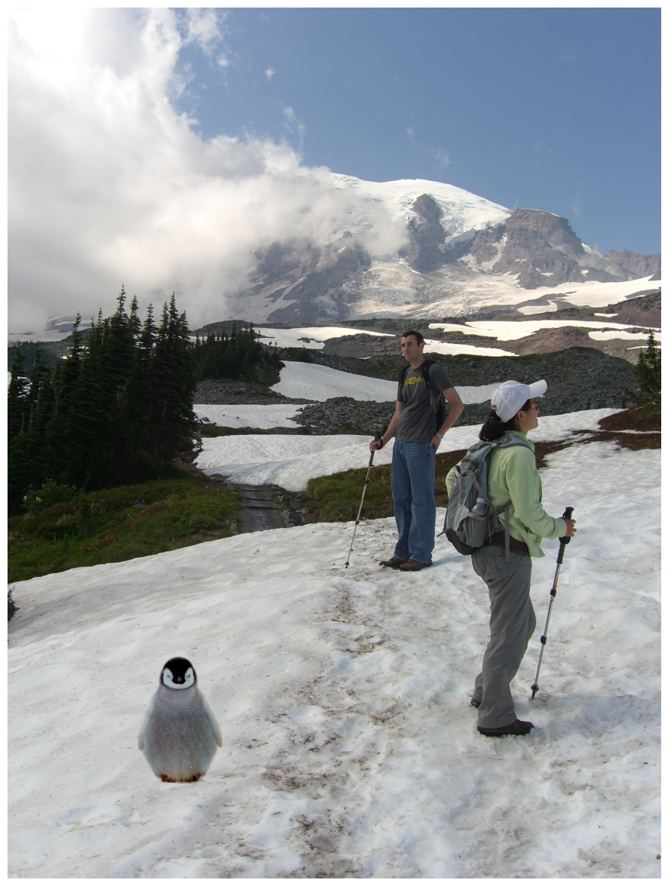
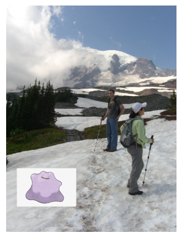
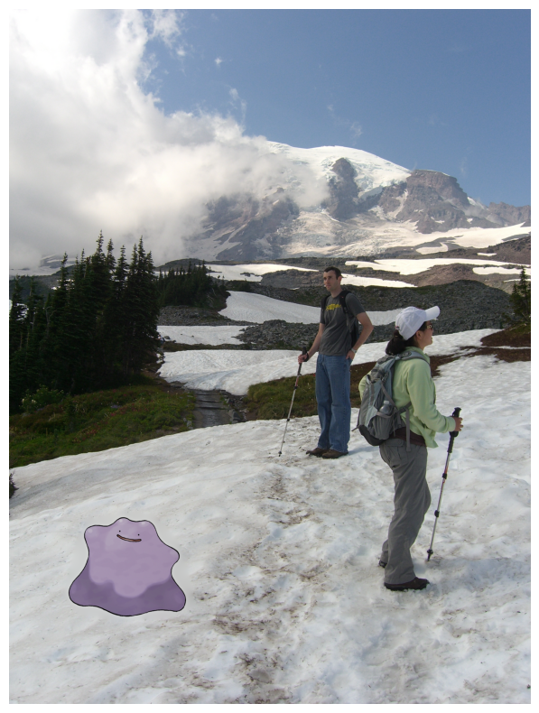
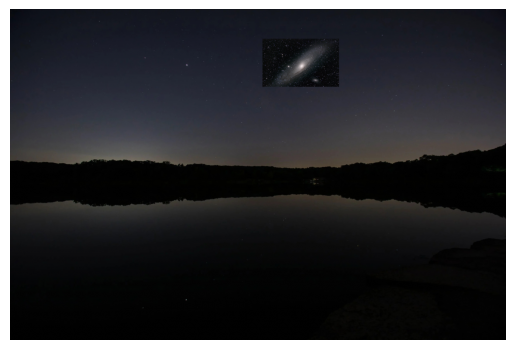
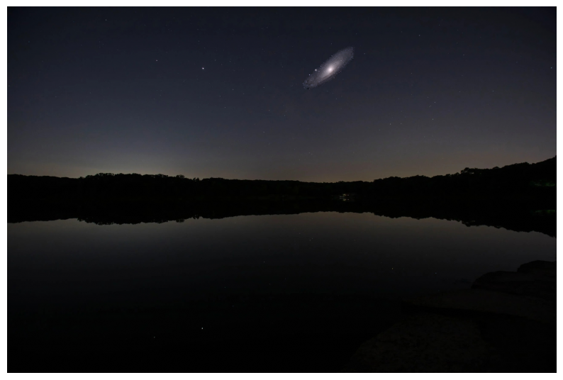
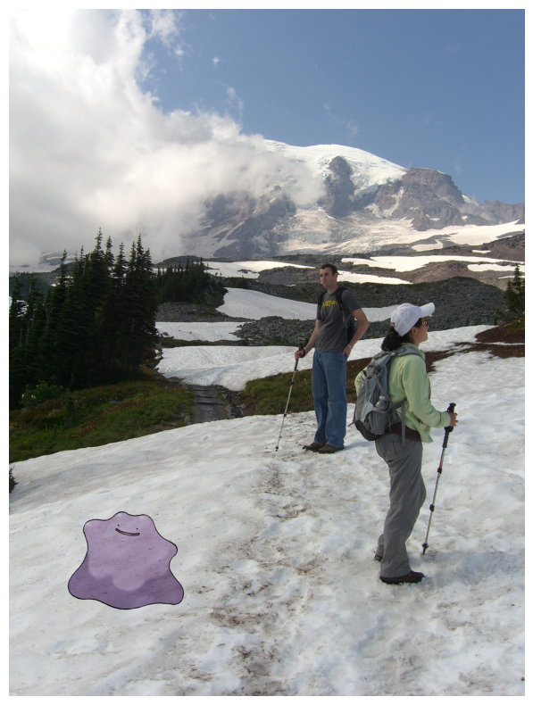

## Final Project: Light field Camera

In this final project, I chose to implement two of the precanned projects: light field camera and gradient domain fusion.

### Part 1: Light Field Camera

The entire objective of this project is to explore how taking multiple images of the same scene but from very
slightly different angles. Then, combining these images together in a clever way allows us to form a
composite image that has vastly different properties. Here, we explore two such properties: the location of
focus and also the aperture of the image.   
         

### Depth Refocusing

The first part of this project is implementing an algorithm to combine the images in such a way that we can
selectively focus on a specific portion of the image. More concretely, this means that we can "refocus" onto
objects at different depths in the image. To do this, we leverage the parallax effect, where objects up close
move more quickly through the frame than objects which are far -- this means that if we shift the images by
the appropriate amount, we can ensure that one portion of the composite image remains in focus, while
distorting the others. In terms of code, we can do the following:
1. Because the images are lined on a 17x17 grid, then we compute the center image, which lies at (8, 8).
2. For every other image, we compute subaperture distance, which is given by `x - 8` and `y - 8`. 
3. We then shift the other images by `(x - 8) * const` and `-(y - 8) * const` using `np.roll()` along the `axis = (0, 1)`. 
The variable `const` is a scaling factor we use to control the amount we shift by, which indirectly controls
focus depth. The negative in the shift along the y-axis is simply there due to `np.roll()`, so that we ensure
we are shifting the images in the correct direction to produce a focused image. 

  

You can see the focus shifting from the pieces in the back to the front, which shows the proper alignment. 

### Aperture Adjustment

Now, we move on to the second part, which focuses on adjusting the aperture. For this section, the only thing
we need to change is the kind of images we want to use when computing the mean image. In particular, we set
an aperture distance using the variable `aperture`, and impose the condition that we only use the image if
`np.abs(x - 8) < aperture` or `np.abs(y - 8) < aperture`. 

To see why this is the correct condition, consider a small aperture, which has a high depth of field. In the
image, this translates to objects far away from the point of focus are still relatively clear. On the
contrary, a low depth of field corresponds blurrier edges, assuming we focus on the center of the image. Now
consider the condition we impose: for points which satisfy the aperture inequality (for a reasonably small
value of `aperture`), it means that the location of the same object within all the images will be nearly the
same, so when we compute the mean image even objects which are far from the point of focus are still
basically in focus. When we increase the value of `aperture`, parallax effects start dominating, which causes
objects which aren't near the point of focus to become blurrier.   

Below is an example where we take `aperture` between values 1 and 5, while setting the refocusing constant to
`const = 2`. As can be seen in the gif, as the aperture increases we lose more of the chess pieces in the
back as they are far away from the point of focus (in the front).  
      

  

Here, you can see the depth of field changing, as evidenced by the objects in the back becoming progressively 
blurrier as the aperture increases. This mimics exactly what we see in a real camera, which was really cool 
to see. 

### Summary

This was really cool to learn about! As an avid camera person, it was cool seeing how multiple copies of the
same scene can be taken, and used together to change things like the point of focus and aperture using such
simple operations, and produce something that is akin to a result you would get from a digital camera had you
actually varied things like the focus and aperture size. For me, I think the beauty here is in the simplicity
of the algorithm: just a simple shift combined with an averaging can produce a result that I never would have 
expected.

## Part 2: Gradient Fusion
For this part of the project, I made use of the suggestions and the starter code provided in
[this link](https://courses.grainger.illinois.edu/cs445/fa2023/projects/gradient/ComputationalPhotography_ProjectGradient.html)
to complete this project. This, along with some pointers from my friends, were instrumental 
in completing this project.

In this part of the project, we implement a more complex version of what we did in project 2: image blending.
In the latter part of project 2, we implemented a way to blend two images together, making use of a Laplacian
to ensure that we get a good blending procedure. In this project, we investigate Poisson blending, a
procedure used to blend two images together using gradients. In theory, this should work better than 
a naive Laplacian stack, namely because gradients in an image tell us where features lie, so if we can 
figure out how to mix them together properly, we in theory get the best kind of blending.  

Before delving into the code, we should go over how the process actually works, and do to that let's revisit
our goal: ultimately we want to blend two images together, so this amounts to finding the optimal way to
"stitch" a source image `src_img` onto a target image `targ_img`. To do this, we essentially just need to
consider how the boundary between the source and target images interact, since determining the best way to
navigate the transition will give us the optimal way to stitch the two images together. To do this, Poisson
blending essentially calculates gradients in and around the patch where we want to blend the two images
together, using gradients in the source image to determine how to fill the inside of the patch, then using
the edges to determine how to "stitch" them together. 

Put simply, the theory is like this: given the gradient of a function (in this case, it's an image) and also
some boundary conditions, you can determine how the function behaves over the entire space. 
This is essentially what Poisson blending does. In particular, Poisson blending finds the function that
minimizes the gradient, so that we get a smooth transition between the source and target images:

$$ \mathbf{v} = \text{argmin}_{\mathbf v } \sum_{i \in S, j \in N_i \cap S} ((v_i - v_j) - (s_i - s_j))^2 + \sum_{i
\in S, j \in N_i \cap \neg S} ((v_i - t_j) - (s_i - s_j))^2 $$

This equation mathematically describes what we talked about above: $$N_i$$ is the set of points that are
neighbors of pixel $$i$$, which are the four pixels above, below, left and right. $$S$$ is the set of points
that are in the source image, and the complement are the points that are not in $$S$$. The argmin condition
selects the image vector which minimizes the gradient; the first term encodes the gradient inside 
the patch $$S$$, and the second term sets our boundary condition. 

### Toy Model 

From the previous section, it should be clear that a central part of Poisson blending is figuring out how to
reconstruct an image given the gradients and an initial condition, which is what we do here with a toy model
to familiarize ourselves with it. Here, we will take the image `toy_problem.png` given in the project spec
and try to recreate it by computing the gradients. To do this, we have three constraints to satisfy:
1. Minimize `(v(x+1,y)-v(x,y) - (s(x+1,y)-s(x,y)))^2`.
2. Minimize `(v(x,y+1)-v(x,y) - (s(x,y+1)-s(x,y)))^2`.
3. Minimize `(v(1,1)-s(1,1))^2`.

The third condition is there to essentially set an initial condition, since the addition of any constant to
the solution of the first two is also a solution. This third condition is essentially the "initial condition"
we were talking about earlier. In terms of code, we can implement this as a least squares problem, as
follows:

1. First, start with a list `im2var[i, j] = np.arange(n_rows * n_cols).reshape(n_rows, n_cols)`. This
essentially gives us a way to index into $$\mathbf v$$ properly. Then, we calculate the number of
constraints, given by `num_constraints = (n_rows - 1) * n_cols + n_rows * (n_cols - 1) + 1`. The first two
terms are the constraints in the `x` and `y`, and the final `+1` is the initial condition.  
2. We start with a sparse matrix `A = scipy.sparse.lil_matrix(num_constraints, n_rows * n_cols)`, and an 
equation counter `constraint = 0` that counts the constraint we are on. Initialize `b =
np.zeros(num_constraints)` as a zero vector for now. 
3. For each pixel `(i, j)` in the image, we compute two gradients, one in `x` and `y`. As an example, the
`x`-direction constraint looks like: `A[constraint, im2var[i, j + 1]] = 1` and `A[constraint, im2var[i,j]]
= -1` This encodes the `v(x + 1, y) - v(x, y)` part of the constraint above. We then use `b[constraint] =
img[i, j + 1] - img[i, j]` to encode the `s(x + 1, y) - s(x, y)` part. The least squares condition will then
find the `v` that makes `v(x + 1, y) - v(x, y)` as close as possible to `s(x + 1, y) - s(x, y)`, which is
equivalent to finding the minimum of the difference.   
4. After iterating through all the pixels, we can solve this least squares using `scipy.sparse.linalg.lsqr(A,
   b)`. We then reshape the solved vector `v` into `img.shape` so that it generates an image. 

Doing this on `toy_problem.png`, we get the following result:
  

  

According to the code, the maximum error between the two images is is 0.35, but to be honest I can't tell you
where that difference comes from; the images look completely identical.  

### Poisson Blending

Now we are ready to move on to the Poisson blending part of this project, which aims to minimize the
objective we laid out earlier. We generate the patch we want to stitch using a mask over the source image,
which we implement using a slightly modified version of what we had in project 2 to select correspondence
points. This is done using the `get_mask(img, num_points)` function I define, where `num_points` defines the
the number of vertices we use for the polygonal mask. For instance, I used the `penguin_chick.jpg` using a
7-point mask, which came out like this:

  

Now we move to the blending process itself. The approach here is actually very similar to that of the 
previous part, with the only major exception being that the nubmer of constraints is not immediately 
known, since the summation in the constraint is over $$i \in S$$, so the number of constraints is directly
tied to the number of pixels in the mask. Because we are using an irregular mask, this is impossible 
to determine beforehand. So, we modify the procedure from the previous section slightly: 

1. Initialize `A` first as an "empty" sparse matrix of dimension `(0, n_rows * n_cols)`, since we start 
off with zero constraints. Initialize `b` to be an empty list for the same reason.  
2. Iterate through every pixel in `src_img`, but only look at the points $$i \in S$$, so this corresponds 
to points where `object_mask[i, j] = 1`. Then, for every such point, we initialize a row of `A` 
using `A_row = scipy.sparse.lil_matrix(1, n_rows * n_cols)`, which we now proceed to populate depending 
on the values of the four neighbors of the pixel `(i, j)`. To get the neighbors I defined a helper 
function `get_neighbors(i, j)`, which returns the four adjacent points, which is then accessed 
using `object_mask[x, y]`. Depending on the value of `object_mask[x, y]`, we then do one of the following:
    1. If `object_mask[x, y] = 1`, then the neighboring point is also in the mask, so this is part of the
    first summation term. In this case, we set `A_row[0, im2var[i, j]] = 1` and 
    `A_row[0, im2var[x, y]] = -1`, to match the first term. We then append 
    `object_img[i, j] - object_img[x, y]` to `b`, matching the $$s_i - s_j$$ term.  
    2. If `object_mask[x, y] = 0` (the only other case because our mask is binary), then the constraint
    belongs to the second term. Here, we don't subtract $$v_j$$, so there are no modifications to `A_row`.
    For `b`, we now append `object_img[i, j] - object_img[x, y] + bg_img[x + bg_ul[0], y + bg_ul[1]]` to match the $$t_j - (s_i - s_j)$$ term. The `bg_ul` is a tuple containing the upper left corner of where we want our image to be pasted; this is used here so that we extract the proper pixel intensity from the background image. 
3. Now, we append `A_row` to `A`, and move on to the next pixel. Once this is done for all pixels, we do the same thing as the previous section: we use `scipy.sparse.linalg.lsqr(A, b)` to solve for $$\mathbf v$$ and reshape to `object_img.shape` to produce a picture.
4. We then paste this reconstructed image onto the background canvas, using the provided `utils.get_combined_img()` function in the `utils.py` file. 

With all these steps complete, we now have the fully blended image, shown below. I've also included a "naive" blending, which just consists of replacing the patch with the source image with no blending at all. Of cousre, you can see the big difference blending makes.
 

  
  
  
 
  Left: Naive blending, Right: Poisson blending

One thing I would like to mention here is that yes, while the blending indeed looks nicer than the Laplacian stack blending we did in project 2, the cost we pay is a significant jump in runtime. By comparison, the Laplacian stack blended similar size images in 10 seconds, whereas this blending took 7 minutes. In the Laplacian stack, our runtime is more or less dominated by the dot product of the image with our mask, which runs in overall roughly $$O(n^2)$$ time, $$n$$ being the number of pixels in the source image. Here, because we are calculating least-squares, then this runtime jumps up to $$O(n^3)$$ time, so the computation becomes expensive really really quickly. This is more clear with the following blend, where I blended a ditto:
 

  
  
  
 
  Left: Naive blending, Right: Poisson blending

This image, despite being only like 1.5x the size of the penguin, took a whole 42 minutes to generate. I do very much like the result though, the end result makes the runtime worth it in my opinion. Finally, this next combination I was mainly inspired by all the images saying "this is what the night sky will look like in 2 billion years when the Andromeda collides with our milky way":

  

Obviously this looks bad because it's not blended, so let's poisson blend them together: 

  

Clearly this is a much better result. My one gripe is that the Andromeda galaxy looks a little small here, but in the interest of not blowing up my laptop, I think this is a good compromise.

### B&W: Mixed Gradients

For the Bells and whistles of this project, I chose to do the mixed gradients blending. In this approach, we make a slight modification to the objective function:  

$$ \mathbf{v} = \text{argmin}_{\mathbf v } \sum_{i \in S, j \in N_i \cap S} ((v_i - v_j) - d_{ij})^2 + \sum_{i
\in S, j \in N_i \cap \neg S} ((v_i - t_j) - d_{ij})^2 $$

Here, $$d_{ij}$$ is the value of the larger gradient magnitude between the source and target image. In Poisson blending, $$d_{ij}$$ was always the source gradient, but here we make the change to sometimes use the target gradient as well. To implement this change in code, we compute the gradients as `src_gradient = object_img[i, j] - object_img[x, y]` and `targ_gradient = bg_img[i + bg_ul[0], j + bg_ul[1]] - bg_img[x + bg_ul[0], y + bg_ul[1]]`, 
and we compare `abs(src_gradient)` and `abs(targ_gradient)`. Then, we use the gradient wiht the larger magnitude in our objective.

In theory, this should give us an even better blending result, assuming that the source image has relatively high gradients compared to the background. Doing this on the penguin image, I get this:

  

To be honest, I don't really see much of a difference between this and the Poisson blending. This is to be expected, since the gradients "behind" the penguin are generally lower than that of the penguin itself, so the mixed gradients will more often than not choose the gradient in the penguin. I do see a difference with the ditto though:  

  

Compared to the Poisson blending, we can see two things: first, there used to be a somewhat blurry patch around the ditto which is now completely gone in the mixed blending (in my view, this is a good thing). However, ditto has now become slightly transparent: this is because the specks in the snow have a higher gradient than ditto, so the algorithm will now select those gradients over ditto, causing him to become transparent. Finally, I did the mixed blending on the `andromeda.jpg` from earlier, and the result looks very similar to the Poisson blending result.

  

This is to be expected though, since the gradient in the night sky photo I chose as a background has a very low gradient, so the mixed gradiens algorithm will end up choosing the gradient in the source (andromeda) almost all the time, so that's why the results look the same as in Poisson blending.

