 

## Project 1: Coloring the Prokudin-Gorskii Collection

Sergey Prokudin-Gorskii (aka. Prokudin-Gorsky) was a Russian chemist and photographer. 
From 1909 to 1915, he pioneered color photography with his three-plate 
photography, where he would take three exposures of the same image, using a red, blue and 
green filter. Then, when processing the image, he would combine the three "negatives" together 
to produce a complete color image.   
 
The task with this project is to replicate this exact process, only with code. To start, we are 
given the blue, green and red glass negatives stitched together in a single image file (in that 
order), which looks something like this:

  

  
 Figure 1: Stitched negatives of cathedral.jpg. From top to bottom: Blue, Green and 
  Red photos. 
 

To start, we cut this image up into three sections, and call them `b`, `g` and `r`. These are 2D numpy arrays 
containing the intensity of each frequency of light. Next, we devise an algorithm that allows us to find the best 
possible alignment of the three negatives. To do this, we will use `cathedral.jpg` as our image to test. We select this 
image in particular for two reasons: first, there's regions with an abundance of features like the cathedral, and also 
regions which lack many features, like the clouds and also the field in the foreground. Second, it's also a relatively 
small image (300 x 300 pixels), so it's not computationally expensive. 

### The Metric

In order to find the best possible alignment, we need some heuristic (also called a metric) that allows us to quantify 
how well a given alignment between two plates `c1` and `c2` are. The easiest and simplest metric to use is the **Euclidean
Distance** metric, which essentially measures the difference in intensity of all pixels in `c1` against `c2`, summing 
over all pixels. As code, this is realized using `np.sum((test - c2)**2)`, where `test` is `c1` shifted by some 
amount `(i, j)`, and `c2` is the fixed color plate (usually the blue one). Here, the theory is that the minimum alignment 
occurs when this metric is minimized. 

In my experience working through this project, I've also found that this metric seemed to suffice and never really seemed 
like a bad heuristic to use to quantify alignment. I'm sure that there are more complex ones out there that probably do the 
job better, but I never really felt the need to deviate from the Euclidean distance. I will note that the project spec also 
mentions that we could have used a Normalized Cross-Correlation (NCC), but while doing this project I found that this was extremely obtuse 
to work with and didn't really work well for me.  

### Naive approach: exhaustive search

Perhaps the most obvious method we can find the best possible alignment is to do an exhaustive search of all possible 
alignments, then return the alignment `(i_opt, j_opt)` that minimizes the metric. While this does *guarantee* that we find the best possible 
alignment, this approach it falls flat since it's **extremely** expensive: consider the 300 x 300 pixel image: for every possible 
alignment there are 900 computations, and there are 300^2 = 90000 possible alignments, so for this image alone there would be 
81 million operations needed!

Clearly, this is not the best approach. What does save us a little bit here is that the optimal alignment isn't very far off 
from just doing nothing (the images are more or less aligned already), as we usually find that the optimal alignment
only shifts a given plate by 10 or so for the small images and 100 for the larger `.tif` files. With reference to the original 
image sizes, this means that the optimal shift only differs from the unaligned images by roughly 1-3%.  
This means that we can 
reasonably search over a range of, say, `[-10, 10]` and be fairly certain that we have the optimal alignment, but of course 
this feels extremely hard-coded and unsatisfying. Therefore, we need a better approach.  

### Image Pyramid 

With the exhaustive search being too expensive, we look to more efficient ways to search for better alignments. To motivate the image 
pyramid method, it's important to note that the only thing holding back the naive approach is the fact that it's way too expensive, 
and not really an indication that there's something wrong with the method itself. After all, to test alignment, we would have to 
compute the euclidean distance at some point, so the real speedup will come from reducing the number of times we compute that 
distance. 

This is where the image pyramid comes in. Instead of computing all 90000 possible alignments of two figures, we instead downscale 
the image to a more reasonable size, chosen to be less than 100 x 100 pixels, and perform the alignment procedure here. With the 
downscaled image, maximally we are computing 1000^2 = 10000 alignments, which is already much better than the 90000 we were working 
with before. Then, with the optimal alignment computed, we then rescale up and update our optimal alignment as we go. Doing this 
recursively using downscaled images massively cuts down on our runtime, even with larger images. 

Further, we also don't have to search through the entire image at the smallest scale. There are two main reasons why this isn't necessary:
first, we already mentioned earlier that the images are more or less aligned already, so we can take advantage of that and conclude that an 
exhaustive search is nowhere near necessary. Second, because we're searching over a coarse image, it allows us to "cheat" and require only that we 
get *close enough* to the optimal offset, leveraging the fact that as we update the offset through higher resolution images, the optimal offset 
will eventually be found.  

### Cropping

Aside from optimizing the runtime of the image processing, one other modification we can make to our images to get even better alignments is to crop
the edges out of the image. To see why, consider the image `church.tif`, run on the above procedure without cropping:
     

    
    
 Figure 2: Uncropped alignment of church.tif. The alignments of the red and blue plates, respectively: 
    (52, -6) and (0, -6). The negative values just mean shifting in the opposite direction, as per the np.roll spec.  
    

As evident in the image, while the alignment isn't bad, it's not the best either, since there are still very obvious 
artifacts visible in the image. When processing these images, it became evident to that the reason this was happening was because of the white 
lines to the left and right of the image, and also the stripes at the top and bottom. As for the white bars, I was under the impression that 
these only existed from the digitization process, so as a result it makes sense to crop the image to get rid of all of them. I found that
cropping 5% from all edges (so only keeping the inner 80%) resulted in a much better image, which we can see below: 

    
    
 Figure 3: Alignment of church.tif with cropping. Red: (58, -4), Green: (24, 0) 

Many of the artifacts that we saw in the uncropped image are now gone, and we're left with a very clean image. This really proves that the culprit 
for our misalignment in the earlier image was indeed the white bars on the left and right, since upon removal we get a much better image. 

Despite the image cropping being a major factor in improving the reconstruction quality, I will note that it's not necessary for all images. For images 
where the intensity of the subject is extremely strong, the alignment was very good even without the cropping procedure. Take the `sculpture.tif` for 
instance:

Uncropped             |  Cropped
:-------------------------:|:-------------------------:
  |  
 
Besides the cropped image being smaller (which is to be expected), there isn't really much difference in the alignment. The reason for this becomes 
clear when we look at the rgb negatives: 

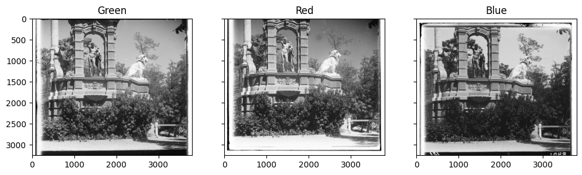

 Figure 3: Red, Blue and Green negatives for sculpture.tif. 

The key thing to notice in these three negatives is that the complexity throughout the image is quite high, meaning that in this particular case, the 
white bars on the left and right of the uncropped image affects the overall metric less, and therefore this allows us to get a better alignment 
even without cropping. We know this to be the case too, since we can take a look at the negatives for `church.tif`:

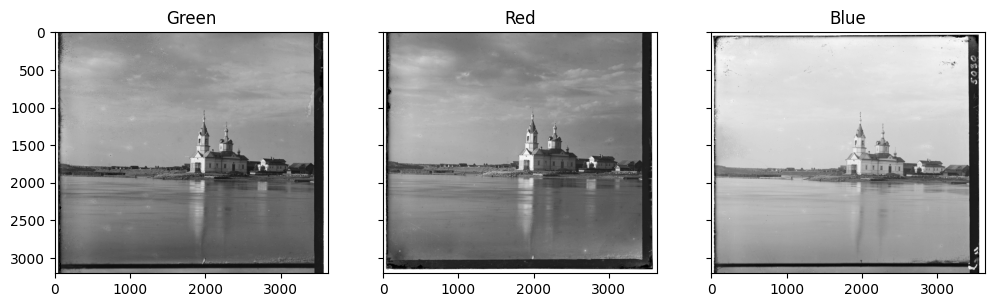
    

 Figure 4: RGB negatives for church.tif 

As expected, we see far less complexity in `church.tif` than `sculpture.tif`, confirming our hypothesis. 

### Aligned Images

The aligned images are shown below, with the optimal alignment in a caption and an associated runtime. 

<table>
  <thead>
    <tr>
      <th colspan="2" style="text-align: center;"> JPEG images </th>
    </tr>
  </thead>
  <tbody>
    <tr>
      <td style="text-align: center;"> Displacement: Red (6, 2), Green (2, 2)   Runtime: 0.07 seconds</td>
      <td style="text-align: center;">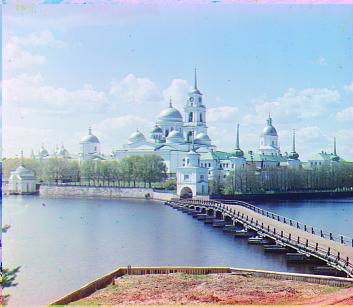 Displacement: Red (2, 2), Green (-2, 2)   Runtime: 0.08 seconds</td>
    </tr>
    <tr>
      <td style="text-align: center;">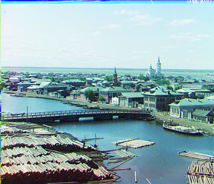 Displacement: Red (6, 2), Green (2, 2)   Runtime: 0.06 seconds</td>
      <td style="text-align: center;"></td>
    </tr>
  </tbody>
</table>

<table>
  <thead>
    <tr>
      <th colspan="2" style="text-align: center;"> TIFF images </th>
    </tr>
  </thead>
  <tbody>
    <tr>
      <td style="text-align: center;">Displacement: Red (58, -4), Green (24, 0)   Runtime: 4.78 seconds</td>
      <td style="text-align: center;">Displacement: Red (0, -1160), Green (48, 24)   Runtime: 5.47 seconds</td>
    </tr>
    <tr>
      <td style="text-align: center;">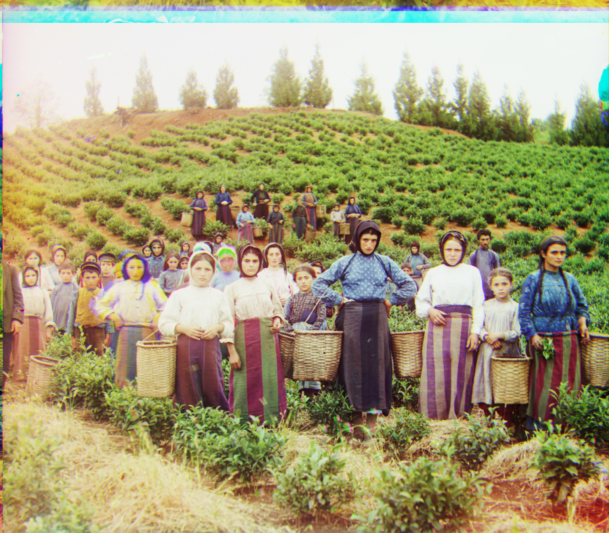Displacement: Red (124, 14), Green (60, 16)   Runtime: 5.06 seconds</td>
      <td style="text-align: center;">Displacement: Red (90, 22), Green (40, 16)   Runtime: 4.84 seconds</td>
    </tr>
    <tr>
      <td style="text-align: center;">Displacement: Red (116, 10), Green (54, 8)   Runtime: 4.93 seconds</td>
      <td style="text-align: center;">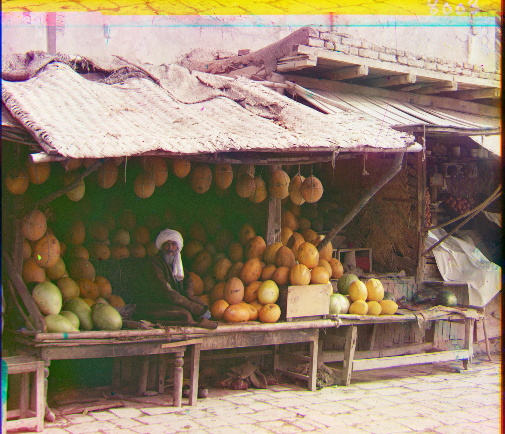Displacement: Red (178, 12), Green (82, 8)   Runtime: 5.90 seconds</td>
    </tr>
    <tr>
      <td style="text-align: center;">Displacement: Red (108, 36), Green (52, 26)   Runtime: 5.60 seconds</td>
      <td style="text-align: center;">Displacement: Red (140, -26), Green (34, -10)   Runtime: 4.98 seconds</td>
    </tr>
    <tr>
      <td style="text-align: center;">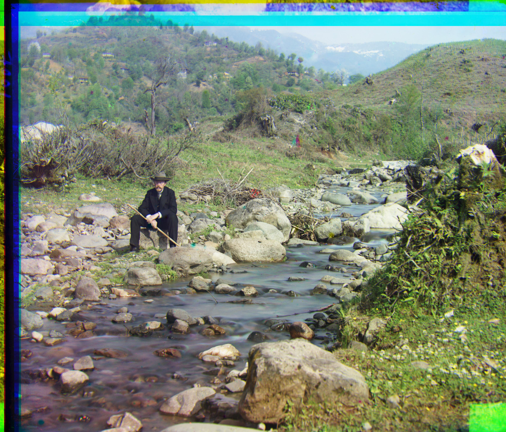Displacement: Red (176, 36), Green (78, 28)   Runtime: 5.16 seconds</td>
      <td style="text-align: center;">Displacement: Red (112, 10), Green (54, 12)   Runtime: 5.33 seconds</td>
    </tr>
    <tr>
      <td style="text-align: center;">Displacement: Red (88, 32), Green (42, 4)   Runtime: 5.04 seconds</td>
      <td style="text-align: center;"></td>
    </tr>
  </tbody>
</table>
 
## Bells and Whistles

In this section, I will go over the "Bells and Whistles" extra credit avenues I chose to explore for this project.  

### Edge Filtering

One idea that came to mind early on when I was brainstorming ways to align the images was to think of better metrics we can use to determine the 
best possible alignment. Then, after successfully implementing the cropping procedure and seeing very good results on all the images, my initial 
goal of improving my metric instead became an exploration into what *other* metrics could be employed to achieve the same result. 

One method I thought of was to try and line up the edges with each other, instead of lining up raw pixel RGB values. Theoretically, this is a much 
better metric than raw RGB values, since contours are more structured than RGB intensities, making them more resistant to image mismatches. To do this, 
I did some digging and found a filter called the **Sobel filter/operator**, which does exactly this. The Sobel operator takes in an image, and produces 
an *edge map* -- basically, it's a black and white image with the only edges of the image highlighted. Let's take `onion_church.tif` for instance:

    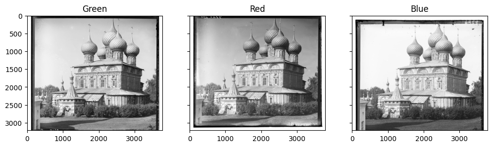

Visually, we can identify the sharp edges around the church, as well as the edges formed by the bushes at the base of the church. Looking at what 
the images look like when passed through a Sobel filter: 

    

We see very clearly the edge detection in action. In the filtered image, only the outlines of the church and the brushes are visible, and everything else
is nearly pitch black. This is beneficial for us to get a better image, since smoother areas which are more prone to misalignment are zeroed out 
after the filter, allowing our alignment to be more precise with less effort. 

#### Theory of the Sobel Filter

The Sobel operator is basically a combination of two matrix convolutions between a matrix which 
varies only vertically, and one that varies horizontally. 

  

As a result of the convolution, G_x and G_y are matrices which detect vertical and horizontal edges in the image. Then, combining them via a Euclidean distance metric:  

  

this combined image now contains information about both the horizontal and vertical edges, creating the overall edge map for the RGB plates as seen above. This explains how the edge map is created, then we use the edge map just as we would the original RGB intensity plates to determine the optimal offset. 

#### Limitations of the Sobel Filter

Despite the power of the Sobel filter, it also has some drawbacks. Perhaps most obviously, the Sobel filter relies heavily on the presence of edges 
in order for it to be effective. That means, given an image with very few edges, the Sobel filter will return a mostly black image, and 
therefore would be quite useless, and we're probably better off using RGB values instead. This wasn't really a problem with any of the 14 images that 
were provided to us, but I did find an image on the Library of Congress that illustrates this point quite well. The following are the RGB negatives 
of an image taken of irrigation ditches: 

    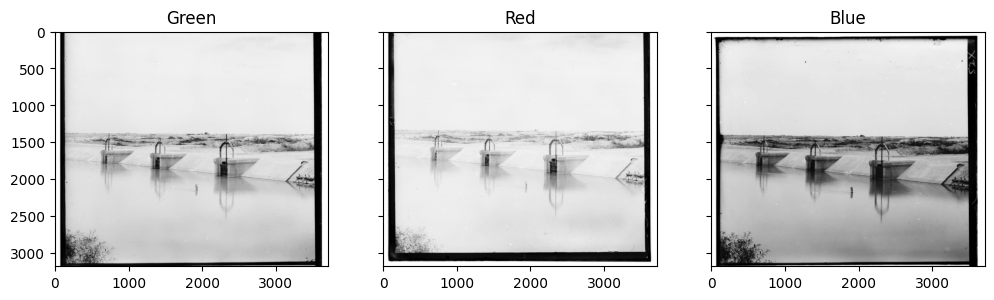

And now passing these through the Sobel filter:

    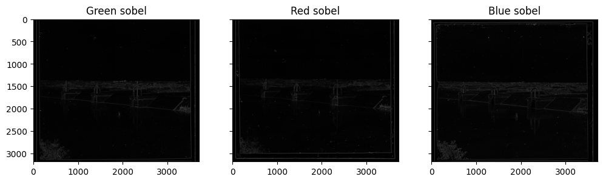

And finally the result from the Sobel filter (on the cropped image):

    

We see the artifacts of a poor alignment here, as it seems one of the channels isn't shifted to the right as much as the others, making the image double. 
Interestingly, however, when we get rid of the cropping, we get a better alignment:

    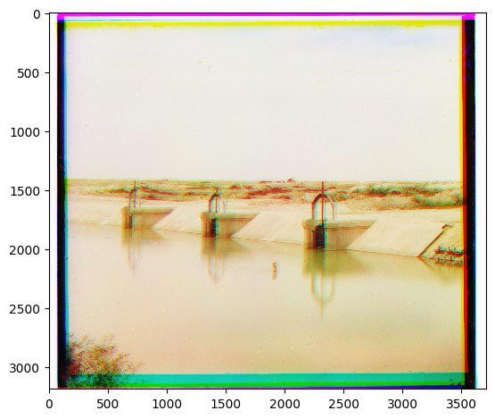

In the cropped image, the features at around `(3000, 1500)` seem to be a little 
blue/purple, but in the uncropped image these blue hues are completely removed, an 
indication of good alignment.

The way I see it, I think this is an indication that there weren't enough features in the cropped image, so the alignment procedure had a hard time deciding 
which alignment was best. However, when we add in extraneous edges introduced by the digitization process (the white bars on the left and right of the 
image), the Sobel filter has much more to work with, and as a result it's able to give us a better alignment of the RGB plates. Of course, this should also 
make intuitive sense, since having more points to align with is always going to be beneficial for us here.  

