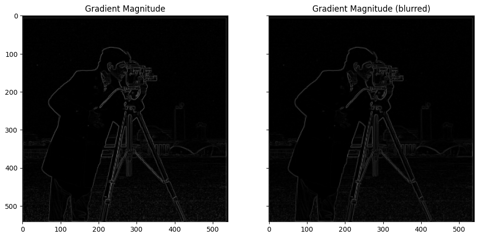
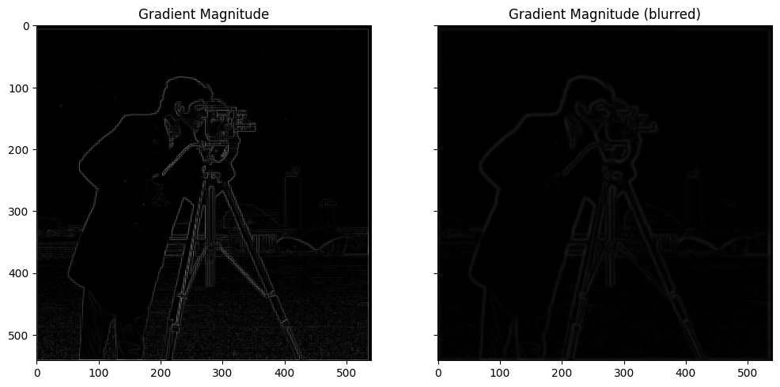

 

## Project 2: Fun with Filters and Frequencies

In this project, we explored filtering, image sharpening, among other things. 

Also, I finally got LaTeX to work on GitHub pages, this totally didn't take me ~3
hours that I could have been spent actually doing the project :)

### Finite Difference Operator

#### Theory 
The finite difference operator is essentially a discrete version of a derivative, and
as explored in the previous project, it's one of the ways that we can generate an
edge map of an image. The principle is that an edge in an image is defined by a
sudden change in the intensity of the pixels in an image, so this would be reflected
as a spike in the derivative. So, one way we can detect this is to build a filter
that computes this derivative. 

One of the simplest derivatives that we can implement is called a **finite difference
operator**, defined as:

$$\mathbf{D}_x = \begin{bmatrix} 1 & -1 \end{bmatrix}, \quad \mathbf{D}_y =
\begin{bmatrix} 1 \\ -1 \end{bmatrix} $$

which we can convolve with our image to find the derivative along the specified axis.
To see why this works, consider how a derivative is computed:

$$ f'(x) = \lim_{h \to 0} \frac{f(x + h) - f(x)}{h} $$

It would be awesome to take a continuous derivative, but becuase we're working in a
discrete space the best we can achieve is:

$$ f'(x) = f(x + 1) - f(x) $$

since the shortest difference we can take for $$h$$ is 1 to subtract adjacent pixels. 
Then, we see the finite
difference operator come out as the prefactors to $$f(x)$$. The convolution process
allows us to "slide" this operator across all the pixels in our image, thereby
allowing us to compute the derivative along one direction for the entire image. Doing
this for the $$x$$ and $$y$$ direction gives us all the information we need, then we
can combine them in a pythagorean-like fashion to get a gradient magnitude:

$$\nabla = \sqrt{\mathbf D_x^2 + \mathbf D_y^2}$$

#### The "Cameraman" image

Now, let's test this out on `cameraman.png`, by initializing $$\mathbf D_x$$ and
$$\mathbf D_y$$ as numpy arrays and using `scipy.signal.convolve2d()` to help us: 

  

  
 Edge map along one direction using the Finite difference
  operators Dx and Dy. 
 

We can see that convolution with $$\mathbf D_x$$ shows us vertical edges, which is
expected since vertical edges have a nonzero gradient in the $$x$$ direction.
Likewise, convolution with $$\mathbf D_y$$ gives us the horizontal edges. We can then
combine these images together to get a full edge map, basically combining the
horizontal and vertical edge information into a single image: 

  

  
 The gradient magnitude map of cameraman.png 
 

This is quite a good edge map, as we see the complete outline of the camerman in this
image. (if we were to do project 1 with this edge map, my best is that this would be
more than enough to get a good alignment) However, many of the features in the background 
have been lost, and if we want to recover that information too, one thing we can try
is to set a "threshold" on the edge map, to "boost" values larger than a certain
threshold to 1. Ideally, I wanted a threshold that could capture the background, but
also limit the amount of grass that makes it into the final image. After some
experimentation, I found that a threshold of about 0.13 probably works the best:  

  

  
 The gradient magnitude map of cameraman.png, with threshold 
  
 

Although we do let some grass in, it's a good middleground between the grass and
getting the big tower in the background in the edge map. 

#### Derivative of Gaussian Filter

One thing we immediately notice about the gradient magnitude picture (threshold and
non-threshold) is how pixelated the image is. One way to fix that while still
retaining the edges is to run the image through a smoothing process first, then
compute the gradient. One way to do this is to convolve the image with a *Gaussian
filter*. To do this, I used `sk.filters.gaussian()` to generate the smoothed
image, then ran the same convolutions as we did before. A side by side comparison is
shown below:

  

  
 Side by side of the gradient magnitude with and without the
  Gaussian filter.   
 

It's a little hard to see, but if you look hard enough you can tell that the
intensity of the lines on the right image are smaller than that of the left. This
makes sense, since the Gaussian basically computes an average over a window, so of
course things will reduce in intensity. The more obvious difference between the two
images is that the image on the right is much smoother than that on the left, and is
a direct result of us applying the Gaussian filter. 

It's also important to mention that the parameters we choose for the Gaussian filter
have a *huge* effect on the resulting image. For the image above, I chose $$\sigma =
0.7$$, which gave a smoothed image where we can still resolve the edges. But, if we
choose a larger $$\sigma$$, say $$\sigma = 2$$, we lose the edges because now the
image is too smooth:

  

  
 Side by side of the gradient magnitude with and without the
  Gaussian filter.   
 

We can also 

