

## Project 4A: Image Warping and Mosaicing

In this part of the project, we explored how to warp images using correspondence
points, and also learned how to generate a mosaic "stitch" of images. With this
ability, we are now able to join together images to create a panoramic image. The
most fun part of this project was definitely the image stitching, and it's still
interesting to think about how my phone camera manages this, since it's somehow doing
this stitching live. 

### Part 1: Shooting Images

I was doing this project late in the physics building, so I took a couple for this
project:

  
  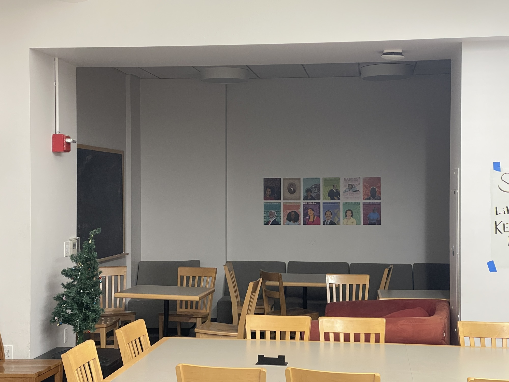

    
    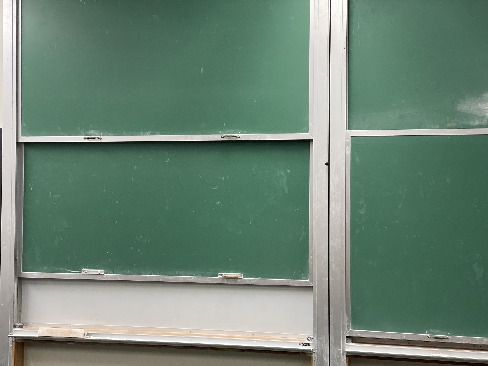

    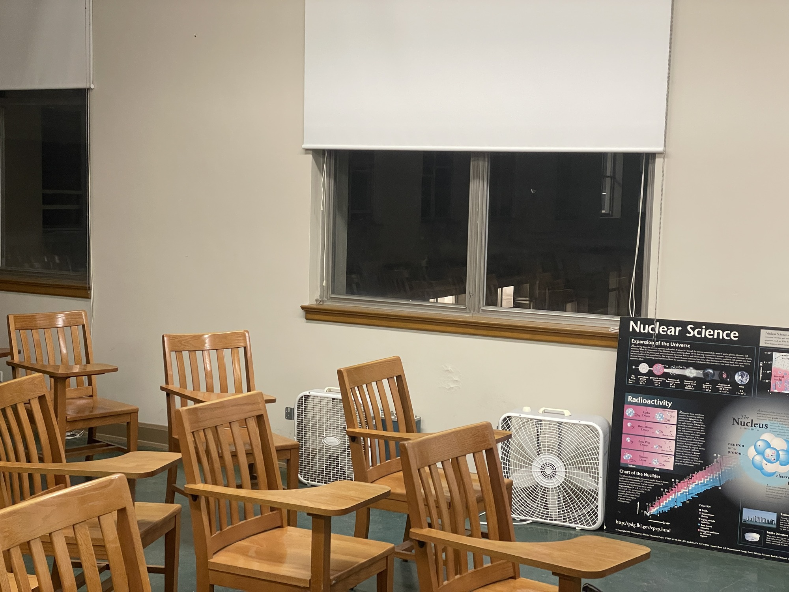
    

These were images I took on my phone, and then rescaled to a smaller size to make the
computation faster. 

### Part 2: Computing Homography

The objective of this section is to explain how we find a homography matrix $$H$$
to match the correspondence points $$p$$ to $$p'$$ for both images. For this
explanation, we follow Alec Li's outline in detail. In essence, finding $$H$$ boils
down to solving the equation $$p' = Hp$$, which can be written out in
vector form as:

$$\begin{bmatrix} a & b & c \\ d & e & f \\ g & h & 1 \end{bmatrix}
\begin{bmatrix} x\\ y\\ 1 \end{bmatrix} = \begin{bmatrix} wx' \\ wy' \\ w'
\end{bmatrix}$$

Solving this system of equations amounts to solving a linear system of equations,
defined by the linear system:

$$ \begin{bmatrix} x & y & 1 & 0 & 0 & 0 & -x x' & -yx'\\ 0 & 0 & 0 & x & y & 1  &
-xy' & -yy' \end{bmatrix}
\begin{bmatrix} a\\ b\\ c\\ d\\ e\\ f\\ g\\ h\end{bmatrix}
= \begin{bmatrix} x' \\ y \end{bmatrix}$$

This system of equations can be solved for each set of pairs $$(p, p')$$, and we can
solve them in parallel by just stacking the different coordinates to make a bigger
matrix and column vector on the right. One thing to note about this system is that
once 4 points are selected, then the system has an exact solution for $$a, b, ...,
h$$. Once more than 4 points are given, then the system becomes *overdetermined*, and instead of an exact solution we need to use least-squares to find the optimal 
homography matrix $$H$$. This method is precisely what the `computeH(im1_pts,
im2_pts)` function does.  

### Part 3: Warping

Now that we've computed $$H$$, we can now move on to performing the actual warp. In
my case, we will have two images `im1` and `im2`, and I will always be warping 
`im1` onto `im2`. Similar to the previous project, in order to perform the warp we
just have to apply $$H$$ to every pixel in `im1`, however this would lead to 
issues because the size of the warped image is almost always larger 
than that of `im1`, so if we were to naively just apply $$H$$ to `im1` 
we will get an undersampled image. Thus, to fix this, we first warp the corners of
`im1` to their appropriate locations, which will also define the polygon in which 
the warped `im1` will reside in. This inevitably sometimes causes the corners of
`im1` to be negative, so to fix this we find the values `x_translate` and
`y_translate` that are required so that the warped `im1` rests perfectly in the 
first quadrant. With the coordinates of the warped `im1` determined, we can now
iterate through every point in this polygon and use 
$$H^{-1}$$ to compute the corresponding point in `im1`
(while also accounting for the translation mentioned just now), then use the same
interpolation procedure we used in the previous project, involving 
`scipy.interpolate.regularGridInterpolator()`. 

Despite the similarities there are also a couple differences between this 
version of warping and the previous version.
First, notice that the third coordinate of $$Hp$$ is not always 1, but in 
order to index into our arrays properly we require that it equals 1, so we need to 
normalize so that $$w = 1$$ every time we apply $$H$$ or $$H^{-1}$$. Another
difference is that in this implementation, I spent a great deal of effort in figuring
out how to vectorize the transformation, so that it can be done much faster. This
ultimately paid off, as it sped up the runtime from ~2 minutes per image to less than 
1 second.  

#### Rectification

One application of this warping procedure is that we can now perform a procedure
called *rectification*, which is the process of perspective transforming a component
in an image into a particular shape. In our case, we will take perspective images of
rectangular objects, then perform the warp such that after warping the image is now
square, or rectified. To do this, we define the correspondence points on the image to 
be rectified as usual, but for the points $$p'$$ we wish to map to I instead defined 
a hard-coded set of points `[0, 400], [400, 400], [400, 0], [0, 0]`, which forms 
a rectangle. This hard-coding makes sense here, since ultimately all we want to do is
transform the selected points in our `im1` into a rectangle. For this part, I took a
photo of my chalk case (hagoromo like project 2!) and also a textbook that was kind
of collecting dust in my home:

    
    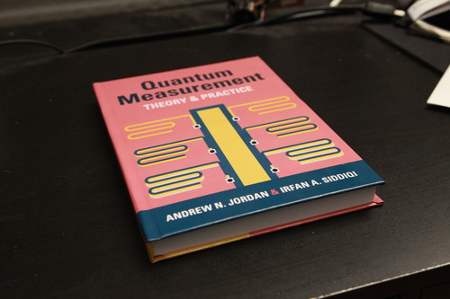

As an aside, notice the difference in image quality -- the textbook I took with my
DSLR, and the chalk case I took with my phone (bad quality by comparison). To compute
the rectification, I selected the following points from both images (marked in red on
the left and yellow on the right):

    
    

Correspondingly, here are the rectified images: 

    
    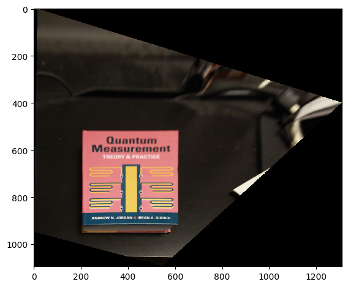

One thing to note with these rectified images is that the more extreme the angle, the
more extreme the resulting warp: it's clear that the chalk case was shot at a much
shallower angle than the textbook, and as a result the corresponding warp distorts
the upper region much more heavily, to the point where the chalk case almost can't be
seen. That said, these images are evidence that the rectification procedure does
indeed work, since the resulting objects (the chalk case and the textbook) both
appear square in the warped image. 

#### Creating a Mosaic

Now, we move on to the final part for part A of this project, which is to join two
images together using our correspondences and stitch the images together. To do this,
I implemented a function `blend(im1, im2, x_translate, y_translate)` to do exactly
this. 

To implement this function, there are a couple things to consider, the first of which
is the translation. Recall that in morphing `im1`, we had to translate it to
guarantee that the resultant image lies in the first quadrant. Because this shift
globally translated every coordinate in `im1`, in order for the alignment to be
proper we also need to apply this translation to `im2` as well; this is why we have
the arguments `x_translate, y_translate` passed into the `blend` function. 

Next, we need to determine the final size of the canvas, which can be done by taking
the maximum between the shifted `im2` and the morphed `im1` dimensions. 
Then, for the blending process itself, we do a 2-band Laplacian pyramid (same as what
we did in project 2), blending the
low and high frequency components separately. In the low frequency regime, we take a
distance transformation using `cv2.distanceTransform()`, then take a weighted linear
combination of `im1_low` and `im2_low` (the result of `im1, im2` 
after the low-pass filter) to determine the low-frequency component of the stitched
mosaic. The weights are calculated using 
$$\text{weight}_i = \frac{d_i}{d_1 + d_2}$$ which is very similar to the 
alpha blending procedure we used in project 2. One thing to note about this weight
procedure is that sometimes it gave me division by zero errors, so I had to
artificially add a very small `1e-5` to fix this.
 
For the high frequency components, the distance transformation alone was used as the
tiebreaker for whether we took the high frequency in `im1` or `im2` 
for each point. That is, if `dist1` has a higher value than `dist2` at 
some `[x, y]`, then `im1_high[x, y]` was taken, and vice versa. 

Finally, we add the low and high frequency components together, in the same way we
collapsed the Laplacian stack in Project 2. Taking the images
from the physics building (source images are at the top of the page),
defining the corresponding points, we can get the
following image stitchings:  
 

    
    

  
 Left: stitched images of the physics reading room. 

  
 Right: stitched images of physics 251, one of my go-to 
  spots for studying.  

    

  
 Also a stitched image of Physics 251, just a different part of
  the room. 

Unfortunately, you can't read the text on that poster, because I downscaled the
image beforehand so that I can use the provided correspondence tool (the image was
too big otherwise). Nonetheless, all three of these images demonstrate evidence of
proper stitching, since we can't see any seams where the interfaces of the two images
lie.

This last part of the project was incredibly cool to see working: in retrospect, it
the mathematics and procedure make a lot of sense to me, but even after everything I
still think that it's extremely impressive that we're able to come up with procedures
to accomplish complex tasks like this -- and all it really takes is a little linear
algebra.   

## Project 4B: Autostitching

For part B of this project, our goal was to essentially automate the process we 
did manually in part A -- namely, devising an algorithm that chooses the 
correspondence points for us. To begin, the first thing we'll need is a way to detect
good feature points in the image, and perhaps the best type of feature we can get in
an image are the corners present. Corners define sharp edges in both $$x$$ and $$y$$ that are easy for
computers to distinguish, so these are what we are going to look for. This part of
the project will heavily follow the steps outlined in the paper Brown et al.,
"Multi-Image Matching using Multi-Scale Oriented Patches". 
 

### Harris Interest Point Detector

One way to detect such features in an image is to use a *Harris Interest Point
detector*, or a Harris filter. In essence, the Harris filter does this: it takes a
small window of the image, and then moves along the window in multiple directions,
and measures the change in pixel intensity as you do this. In the case of a flat
region, we expect to see no change, for an edge you'd see a change in one particular
direction, and for a corner you'd expect to see a change in *all* directions.
Leveraging this differentiation is the key to unlocking the underlying mechanism of
the Harris filter. 

For our purposes, the Harris filter was given to us as the `get_harris_corners()`
function, which is what I used to get the Harris interest points. The function
returns a list of `corners`, as well as the intensity of the Harris map `h` at the
corner locations. Plotted over the source image, the Harris interest points look like
this:

    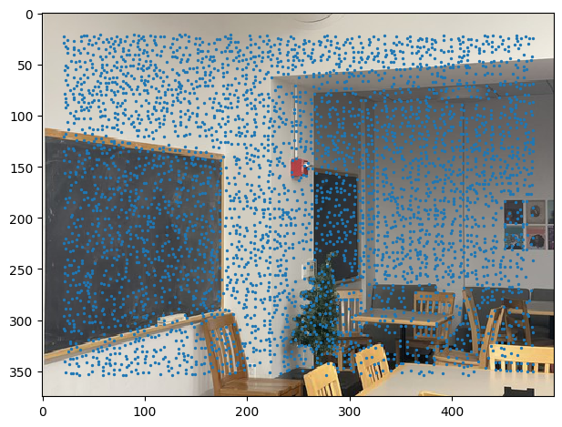
  
 
        First source image, with the Harris interest points overlaid onto it.

As we see in the image, the Harris interest point detector not only selects corners,
but also a bunch of random points which have nothing to do with features in the image
at all, as evidenced in the top left of the image, where that portion is completely
featureless yet the interest point detector still selected them. As such, we now need
to look for a way to sub-select these points, in a way that we get rid of many
"useless" points but keep the corners.  

### Adaptive Non-Maximal Supression (ANMS) 

To accomplish the goal outlined at the end of the previous section, we turn to the
Adaptive Non-Maximal Suppression (ANMS) algorithm devised in Brown et al. In this
step, all the Harris interest points are gathered together, and their pairwise
distances are compared using the provided `dist2()` function. Then, we compute, for
each point, the minimum suppression radius around it. This suppression radius is the
minimum distance between two points such that the Harris intensity outside of this
radius is larger by a significant amount. To quote the paper, the condition can be
written out as:

$$ r_i = \min_j |\mathbf{x}_i - \mathbf x_j|, \text{ s.t. } f(\mathbf x_i) <
c_\text{robust} \ f(\mathbf x_j), \ \mathbf x_j \in \mathcal I$$

Following the paper, we choose $$c_\text{robust} = 0.9$$, and this condition is
sufficient to guarantee that most of the noise in the Harris interest points are
removed. Effectively, this is because for regions where the intensity doesn't change
very much, $$r_i$$ will be large, and as a result fewer points will be selected in
that region. Conversely, if there are many changes in the intensity (which would be
the case for edges), then $$r_i$$ will be small, and thus more points are selected in
this region. This is exactly the behavior we want. Finally, we select the top $$
n_{ip} = 500$$ interest points, as given in the paper. Doing so on our image above,
we can see the stark difference that ANMS provides:

  

    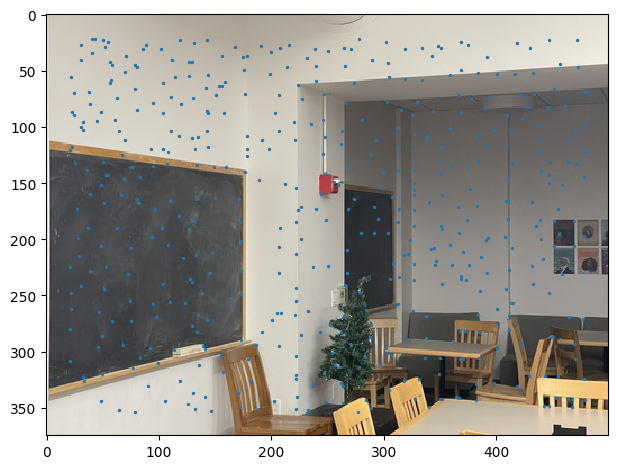
  
 
  Harris interest points, filtered with ANMS. 

We then compute this for both `im1` and `im2`, our two source images that we want to
stitch together. At the end of this step, we'll have two sets of Harris interest
points, one for each image, filtered through ANMS.   

### Feature Descriptor Extraction 

Now, with the interest points selected, we now move on to extracting the relevant
features from the image. To do this, each Harris interest point is taken, and a 40x40
patch of the original image was subselected, and downscaled to an 8x8 image.
This patch was normalized by subtracting the mean and dividing by the standard
deviation, then the patch was flattened to create a feature vector corresponding to
that point, and all of the feature vectors are aggregated into an array. The results
of this section are used in conjunction with the next section, which will display the
results. I've sampled the first 4 images that were computed using this process, and
here are the results:   
 

    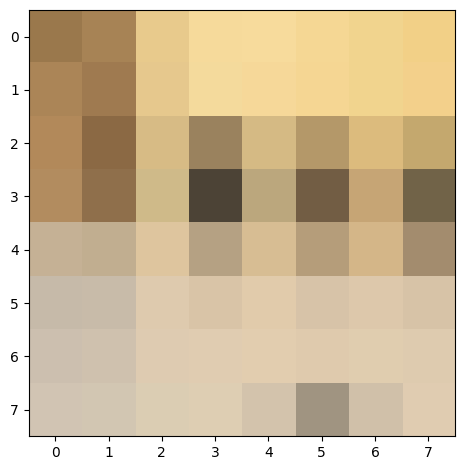
    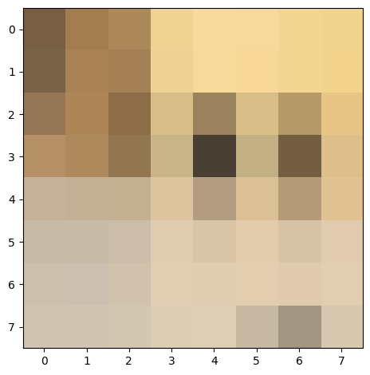
    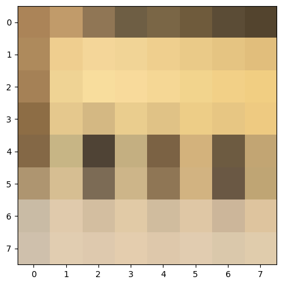
    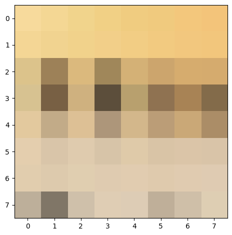

(If you couldn't tell, these are the chairs in the bottom right of the image). These
images are taken prior to the normalization procedure, so that they are visible and
look nice.

## Matching Feature Descriptors

Finally, we come to the process of matching the feature descriptors themselves. From
the previous section, we obtained two large lists of feature vectors `features1` and
`features2`, which contain the feature vectors in `im1` and `im2`, respectively.
Then, in order to compute the match, we do a process very similar to project 1: we
compute the squared distance between the two feature vectors, and see if they're a
match. We perform this operation pairwise for every single feature vector, and sort
the resulting array so that the zeroth index represents the closest match, and the
first index represents the second closest match.

Then, in order to protect against false positives, we use the approach by Lowe, of
dividing the zeroth index by the first index, or essentially the ratio of difference
between the closest and second-closest matching feature. The theory behind this is
essentially that for a matching pair of features, the closest match should be very
small, and the second closest match should be large by comparison. By contrast, two
non-matching features will have comparable first and second differences. So, we can
set a threshold, which we choose to be 0.4, to classify between a positive and a
false positive match. Then, with the matches computed, we can generate a list of
correspondences this way. Computing the list of correspondences for the first two
images at the top of the page, we get the following result:
   

    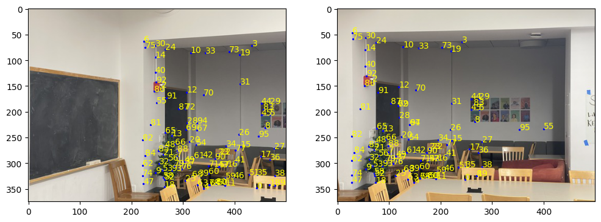
  
 
  Matching features between the first and second images. While there are some
  mismatches, it is clear that the feature matching has done a very good job at
  finding correspondences.    

### 4-Point RANSAC

In this section, we will implement the 4-point RANSAC procedure. RANSAC, or Random
Sample Consensus, is a randomized method by which we basically just try out a bunch
of homographies, and determine the best one by seeing which one generates the most
number of matches. To describe the algorithm in detail, we will start with the
matching features we obtained from earlier, and the coordinates for these features
are initialized. Then, we will randomly select 4 matching coordinates, and compute a
homography matrix $$H$$ with them. With $$H$$ determined, we apply $$H$$ to all the
matched coordinates from `im1`, and compute the Euclidean distance between these
warped points and the matching coordinates in `im2`. One small subtlety here that is
also present in the first part is that we must normalize so that $$w = 0$$ in order
to make sure that we are computing proper matches. Then, we count the number of
points whose Euclidean distance between the warped `im1` coordinates and its matching
`im2` coordinates are within `threshold` of each other -- these points are called *inliers*.
Repeating this sampling process many times reduces variance, and eventually we 
will take the homography matrix $$H$$ which gives us the maximum number of matches. 
For this project, I computed the homography matrix 1000 times, which seemed to be
large enough. As for the threshold, I found that realistically any threshold 
under 100 seemed to do equally well; I couldn't find much of a difference. To play it
safe, I ultimately went with a threshold of 10. Computing this process on the first
pair of images, we get:

   

    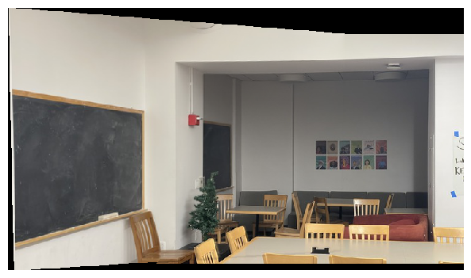
  
 
  Matching features between the first and second images. While there are some
  mismatches, it is clear that the feature matching has done a very good job at
  finding correspondences.    

I ran it on the other two images as well, and these are the results:
 

    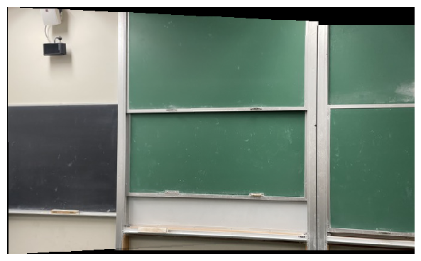
    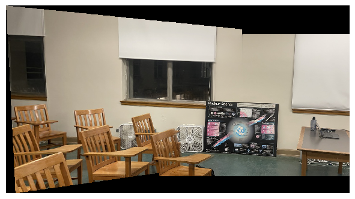
  
 
  Autostitching process completed on the other two images listed at the top of the
  webpage.    

So far, I've been working with extremely downscaled images because of computational
limits, but towards the end of the project I noticed that increasing the `sigma`
parameter in `sk.feature.corner_harris()` (the function that computes the Harris
corner) makes the computation faster, and so I proceeded to then try the blending
procedure on the raw 4k images themselves, and I got these stitches instead: 
 

    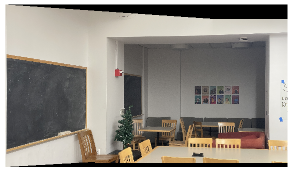
    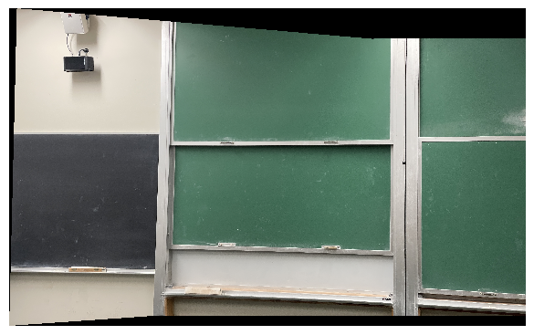
    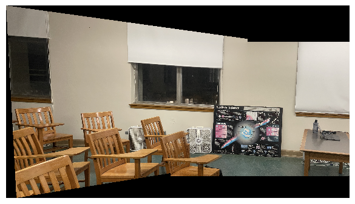
  
 

In theory, working with larger images should give you a better feature matching,
because the 40x40 window that surrounds the feature are now more accurate, and thus
captures matching features better while being more resistant to false matches. Also,
computing this on the raw images is nice, because I could never have done this
manually -- the correspondence tool provided resizes the image to scale, and a 4k
image just becomes too large that it covers my entire screen, making it impossible to
select correspondences. 

I wanted to take some time and also speak to the quality of the stitching: as is
evident in these last three results, the autostitching does as good if not a better
job than the manual process we implemented in 4A. This is not to say that the
stitches in 4A were bad, but just that these will be nicer. This is because the
homography matrix $$H$$ becomes more and more accurate the more corresponding
features you feed it, and the automatic feature matching makes it very to select 90+
correspondences very quickly. If I were to do this manually I'd never have the
patience to select 90 correspondences, so in this sense, the automatic stitching is
just better than the manual stitching. 

Further, we effectively have two layers of protection against false positives: first,
we filter them out in the feature detection process using the first and second
nearest neighbors, enforcing a ratio of less than 0.4 between them. Then, the RANSAC
procedure is also robust, since upon repeating the selection process 1000+ times,
it's unlikely that we won't have found at least one homography that aligns nearly
every point perfectly, just by sheer probability. So, even though manual selection
does guarantee 100% accuracy in the correspondences found, our automatic stitching
gets close enough to this 100% accuracy that the cost of manual selection now greatly
outweighs the time taken to compute automatic stitching, thus making auto-stitching
an objectively better algorithm.  

For me, possibly the coolest aspect of this project was the ANMS algorithm; in my
opinion, it is easily one of the most clever algorithms I've come across, and it
works so effectively despite being so simple. In one single equation, it not only
gets rid of many "noise" interest points, but it also ensures that we get a
fairly even spacing between interest points, ensuring that our entire image is
uniformly sampled across. This last point, the uniform sampling, is perhaps what
impresses me the most about this algorithm -- we basically managed to uniformly
sample an image without using a probabilistic sampling method at all! Personally, I
think that's just an amazing result, and definitely deserves being the coolest part
of this project.    
  
 
  
  
 
      
 
  
 

  
  
  
  
  
 
 
   
  

